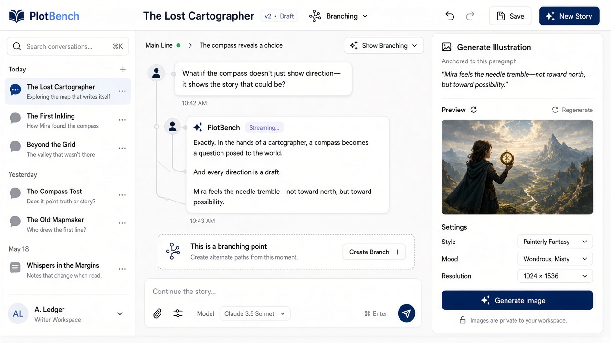
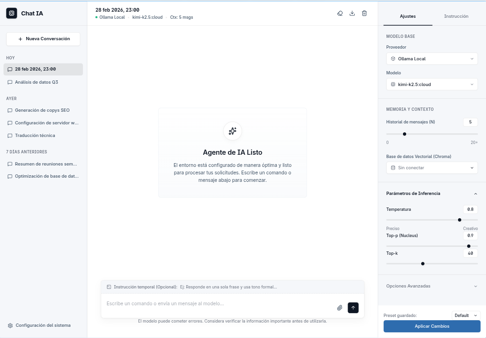

<div align="center">


# PlotBench

**Tu banco de pruebas local para chat con LLMs, ramas de conversación, RAG e ilustración anclada al relato.**

Habla con modelos locales o remotos, bifurca ideas cuando te desvíes, recupera contexto útil
y genera imágenes ligadas a un párrafo concreto — todo en una sola estación de trabajo.

<br>

[¡Arrancar!](#arrancar) · [Cómo se ve](#cómo-se-ve) · [Qué incluye](#qué-incluye) · [Docs técnicos](TECHNICAL.md)

</div>

---

<p align="center">
  
</p>

## Cómo se ve

UI clara en tres columnas: historial, conversación y herramientas de imagen.

<p align="center">
  
</p>

## Qué incluye

| | |
|---|---|
| **Multi-proveedor** | Ollama como base local; OpenAI y otros proveedores cuando tengas credenciales. |
| **Historial en árbol** | Bifurca desde cualquier mensaje. Explora una idea sin perder el hilo principal. |
| **RAG listo** | Memoria vectorial con ChromaDB para recuperar lo que importa del historial. |
| **Ilustración anclada** | Un planificador propone escenas; un worker las genera (Forge Neo) ligadas a un párrafo. |
| **Local-first** | Corre en tu máquina. La nube es opcional, no el centro del diseño. |

Ideal si escribes, diseñas narrativas, experimentas con modelos o quieres un chat serio sin renunciar al control.

## Arrancar

**Necesitas:** Python 3.12 · Node (para el frontend) · opcionalmente Docker para ChromaDB y Ollama en local.

```bash
git clone https://github.com/pcgarat/plotbench.git
cd plotbench
make setup
make up
```

Abre [http://localhost:8000](http://localhost:8000).

Modo desarrollo (API con reload + Vite HMR):

```bash
make up-dev
```

ChromaDB opcional:

```bash
make chroma-up
```

## Flujo típico

1. Elige proveedor y modelo.
2. Empieza una conversación (o recupera una anterior).
3. Bifurca cuando quieras probar otro camino.
4. Si escribes relato, ancla una escena a un párrafo y genera la ilustración.

## Stack

`Python 3.12` · `FastAPI` · `React 19` · `Vite` · `SQLAlchemy` · `ChromaDB` · Ollama / OpenAI · Forge Neo

## Ir más lejos

Arquitectura hexagonal, contratos de modelo, superficies HTTP, testing y operación: **[TECHNICAL.md](TECHNICAL.md)**.

También: [`docs/ARCHITECTURE_2026-09-26.md`](docs/ARCHITECTURE_2026-09-26.md).

## Licencia

Consulta el repositorio para la licencia aplicable.
