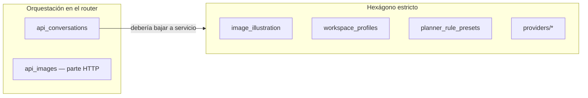
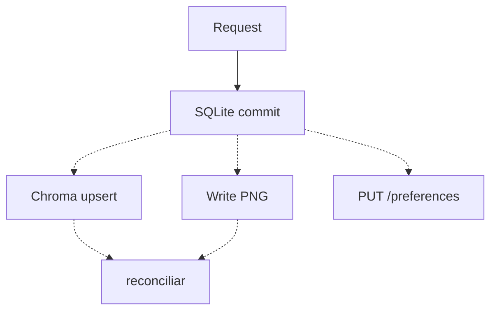

Última modificación: 2026-09-26

# Arquitectura — decisiones y trade-offs

Este documento explica **por qué** el sistema está montado así. El mapa, los flujos y la operación están en el [`README.md`](../README.md). El contrato de modelo tiene diseño propio: [`DESIGN_MODEL_CONTRACT_2026-09-02.md`](./DESIGN_MODEL_CONTRACT_2026-09-02.md).

No es un inventario de módulos. Es un registro de decisiones, con la alternativa que se descartó y lo que esa elección sigue costando.

---

## 1. Objetivos y no-objetivos

### Objetivos

| Objetivo | Cómo se materializa |
|---|---|
| Correr en una estación, sin nube obligatoria | Ollama canónico; remotos solo si hay credencial |
| Cambiar de proveedor sin tocar dominio | `LLMProvider` como `Protocol` + factory |
| Que un modelo nuevo no exija una clase | *Model contract* por fusión de capas |
| No perder trabajo al fallar Forge | Plan ≠ job; cola persistente; reintento sin replanificar |
| Poder explorar variantes de un relato | Árbol de mensajes + *fork* |
| Testear sin GPU ni red | Puertos + SQLite `:memory:` + dobles |

### No-objetivos (deliberados)

- **No es un SaaS.** No hay multi-tenant, rate limiting, cola distribuida ni TLS de borde. El modelo de seguridad asume LAN/localhost.
- **No es un bus de eventos.** No hay outbox, no hay pub/sub. La consistencia entre SQL, Chroma y disco es eventual y se reconcilia a mano.
- **No es un framework de agentes.** Los *slash commands* (`/git`, `/files`) son un parser preparado; no hay un runtime MCP cableado.
- **No hay API versionada.** Un solo proceso, un solo cliente. Romper el contrato HTTP y el shell a la vez es aceptable.

Si alguno de esos no-objetivos deja de serlo, varias decisiones de este documento caducan. No se «añade un microservicio»: se cambia el perímetro.

---

## 2. Principio rector

```
routers  →  services  →  ports  ←  adapters
```

Un servicio no instancia `httpx`, no abre `SessionLocal` y no conoce el shape de un payload de Forge. Si lo hace, el hexágono es teatro.

Eso **no** está aplicado de forma uniforme. El hexágono es real en ilustración, perfiles y proveedores. Es más débil en conversaciones: `api_conversations` orquesta reglas, RAG, contrato y persistencia con `crud` de cerca. Tratar todo el backend como hexagonal es mentir; tratarlo como «hexágono donde duele sustituir un adaptador» es honesto.



**Crítica.** El siguiente movimiento de arquitectura no es otro puerto. Es extraer un `ChatTurnService` que hoy vive diluido en el router de conversaciones. Ahí está el acoplamiento que más duele al testear un turno completo.

---

## 3. Decisiones

Cada ADR responde: contexto, decisión, alternativa descartada, coste que sigue pagándose.

### ADR-01 — Un proceso, no una orquestación

**Contexto.** Chat (stream largo), UI y generación de imágenes compiten por SQLite y, a menudo, por la misma GPU.

**Decisión.** Un Uvicorn + un hilo *daemon* que drena `image_generation_jobs`. Chroma va en Docker porque su runtime (especialmente en Python 3.14) no cabe bien en el venv de la app.

**Descartado.** Celery/RQ + Redis; un segundo proceso `worker.py`.

**Por qué.** En estación local, un broker es un fallo más que vigilar. El job ya es persistente: si el proceso muere, `reset_stuck_image_generation_jobs()` al startup reencola los `generating`.

**Coste.** Un worker. Si Forge tarda 3 minutos, no hay paralelismo de cola. Pausar la cola (`/pause`) es el escape para liberar VRAM, no un scheduler. SQLite con dos escritores exige WAL + `busy_timeout` 30 s + `check_same_thread=False`. Funciona; no es elegante.

**Cuándo revisarlo.** El día que haya dos GPUs, o que el stream de chat y Forge se pisen lo bastante como para que el timeout de 30 s no baste.

### ADR-02 — SQLite, no Postgres

**Contexto.** El esquema tiene 10 tablas, UUIDs, JSON en columnas texto, y un worker en otro hilo.

**Decisión.** SQLite. El motor de aplicación es SQLAlchemy; `DATABASE_URL` podría apuntar a otro sitio, pero nadie lo ha ejercido.

**Descartado.** Postgres embebido o en Docker junto a Chroma.

**Por qué.** Cero operación. Un fichero. Tests en `:memory:`. El producto es *local-first*: pedir Docker para el estado canónico contradice el posicionamiento.

**Coste.**
- JSON no es JSONB: no hay índices por clave dentro de `model_params` / `snapshot_json`.
- El claim de la cola es un `UPDATE` atómico casero, no `SKIP LOCKED`.
- Las migraciones son `ALTER` en `init_db()` que tragan la excepción si la columna existe. Es idempotente y es frágil: no hay historial, no hay rollback, no hay nombre de revisión.

**Cuándo revisarlo.** Cuando haga falta consultar dentro de los snapshots, o cuando WAL + busy_timeout deje de absorber el lock contention. Entonces no «activar Postgres»: introducir migraciones de verdad (`alembic`) *antes* de cambiar de motor. El problema primero es el esquema evolutivo, no el motor.

### ADR-03 — NDJSON, no SSE ni WebSocket

**Contexto.** El chat y la ilustración emiten eventos durante segundos o minutos.

**Decisión.** `application/x-ndjson`. Una línea JSON por evento. Tipos: `token`, `status`, `llm_debug`, `done`, `error` (chat); `placeholder`, `image`, `log` (ilustración).

**Descartado.** SSE (`text/event-stream`) y WebSocket.

**Por qué.** `curl -N` basta para depurar. No hay handshake, no hay *heartbeat* de protocolo, no hay multiplexación. El cliente ya tiene que entender un schema de eventos; no hace falta otro.

**Coste.** No hay reconexión con *last-event-id*. Si cae el TCP a mitad de stream, el mensaje user ya está persistido y el assistant no. El usuario reenvía o borra. Tampoco hay backpressure: un cliente lento no frena al proveedor.

**Crítica.** Para un producto de estación esto es correcto. Si alguna vez hay un cliente móvil o un proxy que bufferiza, NDJSON se vuelve incómodo y SSE sería el salto mínimo. WebSocket sigue sobrando.

### ADR-04 — El historial es un árbol

**Contexto.** Regenerar un turno o explorar una variante no debe destruir la rama anterior.

**Decisión.** `messages.parent_id` + `conversations.active_leaf_message_id`. El camino visible es raíz → hoja. Un *fork* copia ese camino a una conversación nueva (`forked_from_*`).

**Descartado.** Lista lineal con «versiones» de mensaje; o un único documento tipo CRDT.

**Por qué.** El árbol es el modelo mental de ChatGPT/Claude (variantes) y se implementa con una FK. El *fork* a otra conversación evita que una exploración ensucie el hilo principal.

**Coste.** Toda lectura de «el chat» pasa por `conversation_tree.path_from_messages`. La UI tiene que entender hoja activa, no «último mensaje». Los tests de contrato de UI existen en parte porque este modelo se filtra al chrome.

**Crítica.** `forked_from_conversation_id` y `forked_from_message_id` son trazas, no un grafo navegable de linaje. No hay «ver todas las conversaciones hijas de este nodo» como agregado. Si el producto quiere un bosque de relatos, falta un contexto `Lineage`; hoy es metadata.

### ADR-05 — Contrato de modelo por fusión, no por clase

**Contexto.** Ollama sirve modelos con thinking, visión, ctx y semántica incompatibles. Un esquema por proveedor (`provider_params.json`) miente.

**Decisión.** Tres capas, menor → mayor prioridad:

```
provider_params.json  ⊂  show_live (Ollama /api/show)  ⊂  model_overlays/{provider}.json
```

El resultado es un `ModelContract` *frozen*: params, capabilities, recipes, quirks. `empty_model_contract` es Null Object. El generador de overlays es **aditivo** y emite propuesta humana antes de `WRITE=1`.

**Descartado.** Una clase/adaptador por modelo; o copiar el esquema entero en cada preset (el diseño previo).

**Por qué.** Un modelo nuevo funciona el día uno. El overlay solo documenta desviaciones. La UI se construye del contrato, no al revés.

**Coste.** Tres fuentes de verdad que pueden divergir. `show_live` depende de que Ollama esté up; si no, se degrada. Los quirks (`omit_prior_thinking`, etc.) son strings mágicos: no hay tipo sumado que impida uno inventado.

Detalle y roadmap: [`DESIGN_MODEL_CONTRACT_2026-09-02.md`](./DESIGN_MODEL_CONTRACT_2026-09-02.md).

### ADR-06 — Planificar ≠ generar

**Contexto.** Forge falla. Se queda sin VRAM. El usuario quiere otra semilla. El LLM que planificó las escenas no tiene por qué volver a correr.

**Decisión.** `ImageIllustrationOrchestrator` produce un `ScenePlan`, ancla placeholders y encola `image_generation_jobs` con el `forge_body_json` ya materializado. El worker solo ejecuta. `generate-remaining` reintenta sin replanificar.

**Descartado.** Un request síncrono que planifica y genera; o replanificar en cada retry.

**Por qué.** Planificar es barato en tiempo de GPU de texto y caro en tokens. Generar es caro en GPU de imagen y barato en tokens. Acoplarlos convierte un fallo de VRAM en un fallo de producto.

**Coste.** El plan puede quedar desfasado respecto al texto si el usuario edita el mensaje después. No hay invalidación automática del plan. Los placeholders en el HTML del mensaje son un contrato frágil entre dominio y markup.

**Crítica.** `LlmEroticStorySceneSelectionStrategy` y `LlmPornographicPeaksSceneSelectionStrategy` son estrategias de producto, no de arquitectura. El Registry está bien; los nombres filtran un dominio narrativo concreto al hexágono de ilustración. Si el producto se abre a no-relato, esas estrategias sobran y el puerto no.

### ADR-07 — RAG opcional y eventual

**Contexto.** El historial largo no cabe en la ventana. La similitud ayuda; no es el producto.

**Decisión.** ChromaDB en Docker, colección `chat_history`. Si Chroma no está, el chat sigue. El índice se escribe *después* de persistir el assistant. El borrado SQL dispara limpieza; no es la misma transacción.

**Descartado.** Embeddings en SQLite (sqlite-vss); o hacer el RAG obligatorio.

**Por qué.** El producto tiene que encenderse con `make up` y un Ollama. Docker es un extra, no un prerrequisito. Mezclar vectores en el mismo fichero que el árbol acopla dos ciclos de vida distintos (y dos fallos de lock).

**Coste.** Dos orígenes. Dimensiones incompatibles si cambia `EMBEDDINGS_PROVIDER` → `chroma-clean` + reindex. No hay garantía de que un mensaje exista en Chroma. El operador reconcilia.

**Crítica.** `save-to-chromadb` como endpoint suelto admite que el índice se desvía. Está bien documentarlo; no está bien que sea el único camino para un mensaje antiguo. Falta un job de *backfill* por conversación, no un botón.

### ADR-08 — Auth de estación, no de Internet

**Contexto.** Varios usuarios en la misma máquina (o LAN), datos que no deben mezclarse.

**Decisión.** Cookie de sesión opaca, PBKDF2-SHA256 (260k), `HttpOnly` + `SameSite=Lax`. Ownership por `user_id`. Recurso ajeno → **404**, no 403. Filas pre-multiuser (`user_id NULL`) solo las toca un admin.

**Descartado.** JWT, OAuth, sesiones server-side firmadas con su propia tabla de refresh.

**Por qué.** No hay IdP. Un JWT en local es ceremonia. El 404 evita enumerar IDs de otro usuario en una red doméstica donde los IDs se ven en la URL.

**Coste.** Sin `Secure` (HTTP local). Sin CSRF token: `SameSite=Lax` cubre el caso navegador moderno, no un form clásico cross-site. El hash no es Argon2: suficiente para una estación, flojo si el `.db` se filtra.

**Cuándo revisarlo.** El día que se exponga fuera de localhost. Entonces no «poner nginx»: HTTPS, `Secure`, CSRF explícito, y dejar de servir la SPA y la API en el mismo origen sin política.

### ADR-09 — Shell + islas, no SPA «pura»

**Contexto.** El chrome (sidebars, composer, IDs) existía antes de React. Los tests Python asertan esos IDs. Migrar todo a un árbol React único rompía el contrato.

**Decisión.** `App.jsx` monta el shell. Las zonas dinámicas son islas. Estado en `createStore` (observable propio) + `useSyncExternalStore`. Casos de uso en `src/app/` sin JSX. `ports.js` fachada de nombres heredados.

**Descartado.** Redux/Zustand; un único árbol controlado; Context en `#root`.

**Por qué.** El store propio es ~30 líneas y obliga a pensar por agregado. Context en la raíz re-renderiza el chrome. Zustand habría estado bien; no aportaba lo bastante para merecer la dependencia.

**Coste.** `StoreDomSync.jsx` escribe DOM no controlado. Es un olor: hay estado que vive a la vez en store y en nodos. Los tests de contrato Python que leen `frontend/src` son un *lint* arquitectónico disfrazado de test — útiles y acoplados. Si el shell se reescribe de verdad, esa suite sobra y habrá que sustituirla por tests de comportamiento.

**Crítica.** `ports.js` es deuda etiquetada. Cada mes que sigue ahí es un mes en el que el nombre viejo y el nuevo conviven. Matarlo es una tarea, no un patrón.

### ADR-10 — Migraciones en el startup

**Contexto.** No hay pipeline de release. El usuario hace `git pull` y `make up`.

**Decisión.** `init_db()` hace `create_all` y una lista de `ALTER TABLE … ADD COLUMN` que ignoran el error. Encima, tres `migrate_*` + `seed_builtin_rules` + `bootstrap_multi_user`.

**Descartado.** Alembic; o migraciones versionadas a mano con tabla `schema_migrations`.

**Por qué.** Cero fricción. Un pull no pide `make migrate`.

**Coste.** Esto es la deuda más cara del backend, y no se ve en un diagrama C4.
- El orden de los `ALTER` es el orden del fichero.
- Un `ADD COLUMN` mal tipado no se corrige: la columna «ya existe».
- No hay downgrade.
- Los tests no ejercen la migración desde un esquema viejo real; ejercen el esquema actual.

**Recomendación.** Antes de la siguiente columna no trivial: tabla `schema_migrations` + scripts nombrados. Alembic si se prefiere herramienta; lo importante es el registro, no la marca. Seguir con `try/except` es elegir no saber en qué versión está una `chatbot.db` de hace tres meses.

---

## 4. Fronteras de consistencia

No hay transacción distribuida. Quien diseñe un flujo nuevo tiene que declarar en qué frontera escribe.

| Frontera | Semántica | Si falla |
|---|---|---|
| Request HTTP + SQLite | Fuerte, por sesión | 4xx/5xx; el cliente reintenta |
| Stream NDJSON | User persistido al entrar; assistant al cerrar | User huérfano; no hay assistant |
| ChromaDB | Eventual, post-commit | Mensaje sin vector; `save-to-chromadb` o reindex |
| Disco de imágenes | Eventual, post-Forge | Job `failed`; placeholders huérfanos → `prune-orphans` |
| Preferencias UI | Eventual, debounce 600 ms | Último `set` gana; el servidor es fuente de verdad *después* del login |



Regla: **no fingir atomicidad** añadiendo un `try` que borre el SQL si falla Chroma. Eso convierte un fallo de índice en pérdida de relato. Se persiste lo canónico (SQL) y se reconcilia lo derivado.

---

## 5. Dependencias que no se cruzan

| De | Hacia | ¿Permitido? |
|---|---|---|
| `services/*` | `providers.base`, puertos propios | Sí |
| `services/*` | `routers/*`, `httpx`, `chromadb` | No |
| `routers/*` | `services/*`, `crud`, `auth` | Sí |
| `providers/*` | `services/*` | No — el adaptador no llama al dominio |
| `frontend/src/ui` | `src/app`, `src/store` | Sí |
| `frontend/src/ui` | `src/api` directo | Evitar; el caso de uso es la fachada |
| `frontend/src/lib` | React, `fetch` | No — puro |
| `tests/test_*_ui.py` | `frontend/src` vía `frontend_source` | Sí, y es un acoplamiento consciente |

`crud.py` (~1 500 líneas) es el anti-patrón visible: un módulo de persistencia que también deriva títulos, limpia anclas de ilustración y arma snapshots. No es un repositorio; es una capa de aplicación disfrazada de DAO. Partirlo por agregado (conversación, cola, reglas) es más urgente que añadir otro `Protocol`.

---

## 6. Fallos que el diseño ya contempla — y los que no

### Contemplados

| Fallo | Respuesta |
|---|---|
| Forge timeout / VRAM | Job `pending` o `failed`; plan intacto |
| Proceso muerto a mitad de generación | `reset_stuck_jobs` al startup |
| Chroma caído | Chat sin RAG |
| Proveedor remoto sin key | No aparece en `GET /api/providers` |
| Overlay ausente | `empty_model_contract` |
| Lock SQLite transitorio | `busy_timeout` 30 s |
| Misclick de borrar conversación | Soft-delete + papelera |

### No contemplados (deuda explícita)

| Fallo | Qué pasa hoy |
|---|---|
| TCP cortado a mitad de stream | User persistido, assistant no; sin resume |
| Cambio de modelo de embeddings | Vectores ilegibles hasta `chroma-clean` |
| Dos workers (segundo proceso a mano) | Doble claim posible; el código asume un consumer |
| `.db` copiado entre máquinas con distinta migración implícita | Columnas de más/menos; silencio |
| Disco lleno en `illustrated-images/` | Job falla; no hay preflight de espacio |
| MCP real vía slash command | El parser extrae el token; no hay runtime detrás |

---

## 7. Relación con otros docs

| Doc | Rol |
|---|---|
| [`README.md`](../README.md) | Mapa, C4, operación |
| [`DESIGN_MODEL_CONTRACT_2026-09-02.md`](./DESIGN_MODEL_CONTRACT_2026-09-02.md) | ADR-05 expandido |
| [`DESIGN_LLM_PARAMS.md`](./DESIGN_LLM_PARAMS.md) | Diseño previo de params por proveedor (superseded en parte) |
| `docs/specs/`, `docs/plans/` | Contratos de features puntuales |
