Última modificación: 2026-09-02

# Diseño: contrato de modelo (capacidades, params y recetas)

Documento de arquitectura para que cada modelo tenga sus argumentos de API, su modo de funcionar y una UI que saque partido de ello **sin** una clase por modelo.

Complementa (no sustituye aún) a [`DESIGN_LLM_PARAMS.md`](./DESIGN_LLM_PARAMS.md). El diseño actual de params **por proveedor** se queda corto cuando el mismo proveedor (Ollama) sirve modelos con thinking, visión, contexto y semántica distintos.

Investigación de modelos cloud: [`research/ollama-cloud/README_2026-09-02.md`](./research/ollama-cloud/README_2026-09-02.md).

**Estado:** diseño. No implementado.

**Spec / plan / checklist (v1):** [`SPEC_MODEL_CONTRACT_2026-09-02.md`](./specs/SPEC_MODEL_CONTRACT_2026-09-02.md) · [`PLAN_MODEL_CONTRACT_2026-09-02.md`](./plans/PLAN_MODEL_CONTRACT_2026-09-02.md) · [`MODEL_CONTRACT_CHECKLIST_2026-09-02.md`](./checklists/MODEL_CONTRACT_CHECKLIST_2026-09-02.md)

---

## 1. Problema

El sistema asume tres cosas que ya no son ciertas:

1. Los parámetros son del **proveedor**, no del **modelo** (`config/provider_params.json`).
2. El preset del modelo es una **copia entera del esquema** (`config/ollama.json`), no un overlay. Por eso DeepSeek 1M y GPT-OSS 128K viven en copy-paste, y `think` no aparece en ningún sitio.
3. La UI está **hardcodeada** (`index.html` con `param-temperature`, `param-num-ctx`…). Un control nuevo = HTML + JS + JSON.

Además, `build_extra_body` en `app/provider_params.py` solo mira el esquema del proveedor. Si un preset de modelo añade `think`, **no se envía**.

“Modo de funcionar” no es un slider más:

| Modelo | Peculiaridad |
|--------|----------------|
| `gpt-oss:120b-cloud` | Ignora `think: false`; solo `low` / `medium` / `high` |
| `deepseek-v4-flash:cloud` | `false` / `true` / `max`; ctx hasta 1M |
| `gemma4:31b-cloud` | Sampling oficial `temperature=1.0`; no reenviar thought previo; visión |
| `mistral-large-3:675b-cloud` | Visión + tools; **sin** thinking |
| `kimi-k3:cloud` | Frontier caro; visión; thinking hasta `max`; ctx 1M |

Mezclar todo en el acordeón de temperatura es el diseño que limita el producto.

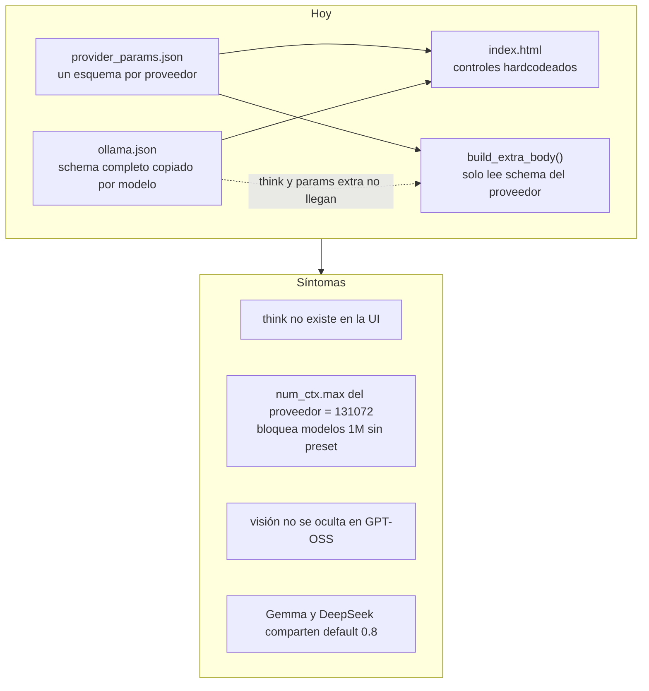

---

## 2. Qué patrón sí (y cuál no)

El patrón **no** es una clase por modelo. Eso explota al añadir el siguiente cloud.

El patrón **sí** es un **contrato de modelo declarativo** (capacidades + esquema de params + recetas), con **Strategy solo en el proveedor**, que ya existe (`LLMProvider`).

| Enfoque | Veredicto | Por qué |
|---------|-----------|---------|
| Clase `DeepSeekAdapter`, `GptOssAdapter`… | No | 8 cloud + N locales = explosión de clases y tests |
| `if model == "gpt-oss"...` | No | Misma explosión, peor de mantener |
| Schema entero por modelo en JSON | Ya duele | Copy-paste; un cambio de tipo toca 20 entradas |
| **Contrato + overlay + Builder** | Sí | El 95 % es dato; 2–3 políticas cubren quirks |

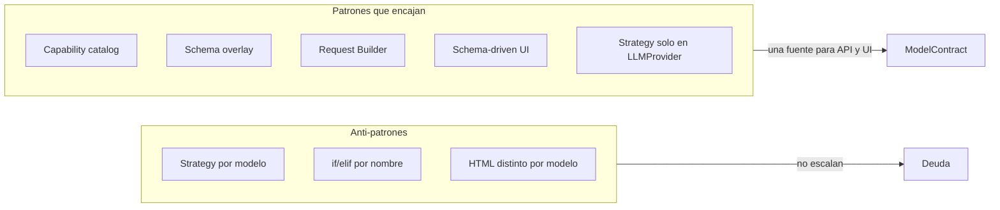

---

## 3. Tres capas (no colapsarlas)

Si se mezclan, o no se saca partido o la UI se vuelve un panel de laboratorio.

| Capa | Qué es | Patrón | Dónde vive |
|------|--------|--------|------------|
| **Capacidades** | qué *puede* hacer el modelo | Feature catalog / Capability object | datos, no clases |
| **Parámetros** | qué *se puede ajustar* y cómo va a la API | Schema + merge (overlay) | config + `show` |
| **Comportamiento** | cómo se *construye* el request y el historial | Builder + 2–3 políticas | dominio |

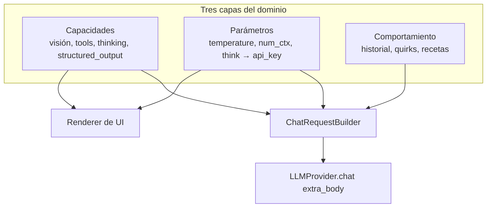

El Strategy de `LLMProvider` se queda. Ollama / OpenAI / Mancer / Abliteration siguen siendo los únicos adapters. El modelo no es una estrategia; es un **documento de contrato** que el builder interpreta.

---

## 4. Hexágono

El dominio habla de “este modelo razona por niveles y no admite visión”. Ollama solo recibe `think` y `options`.

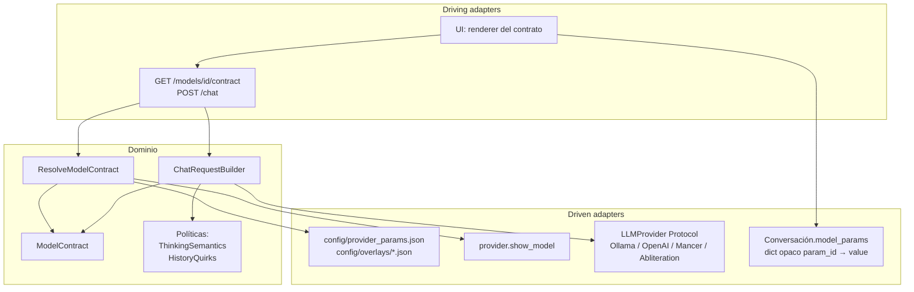

Flujo de un mensaje:

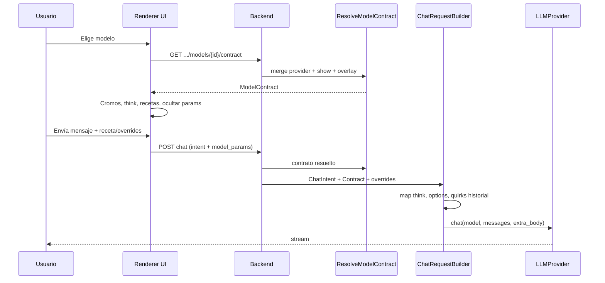

---

## 5. Forma del contrato

No duplicar el esquema entero por modelo. Base del proveedor + overlay sparse + lo que ya da `ollama show`.

```json
{
  "id": "ollama:deepseek-v4-flash:cloud",
  "capabilities": {
    "vision": false,
    "tools": true,
    "structured_output": true,
    "thinking": {
      "kind": "levels",
      "values": ["false", "true", "max"],
      "can_disable": true,
      "default": "true"
    }
  },
  "params": {
    "num_ctx": { "max": 1048576, "default": 32768 },
    "temperature": { "default": 0.3 }
  },
  "quirks": ["omit_prior_thinking"],
  "recipes": [
    { "id": "fast", "label": "Rápido", "params": { "think": false, "temperature": 0.5, "num_ctx": 16384 } },
    { "id": "coding", "label": "Coding", "params": { "think": "high", "temperature": 0.2, "num_ctx": 131072 } },
    { "id": "hard", "label": "Máximo", "params": { "think": "max", "temperature": 0.1, "num_ctx": 65536 } }
  ]
}
```

GPT-OSS, mismo tipo, distinto thinking:

```json
{
  "id": "ollama:gpt-oss:120b-cloud",
  "capabilities": {
    "vision": false,
    "tools": true,
    "thinking": {
      "kind": "levels",
      "values": ["low", "medium", "high"],
      "can_disable": false,
      "true_maps_to": "medium",
      "default": "medium"
    }
  },
  "params": {
    "num_ctx": { "max": 131072, "default": 32768 },
    "temperature": { "default": 0.4 }
  },
  "quirks": [],
  "recipes": [
    { "id": "fast", "label": "Rápido", "params": { "think": "low", "temperature": 0.3, "num_ctx": 8192 } },
    { "id": "analysis", "label": "Análisis", "params": { "think": "medium", "temperature": 0.4, "num_ctx": 32768 } },
    { "id": "hard", "label": "Máximo", "params": { "think": "high", "temperature": 0.2, "num_ctx": 65536 } }
  ]
}
```

Las recetas **no** son el schema. Son perfiles de uso. Gemma coding y Gemma OCR no comparten temperature; DeepSeek chat y DeepSeek SWE tampoco. Un solo `default` por modelo deja el producto a medias.

`think` en Ollama es **top-level**, no `options.think`. El schema ya tiene `api_key`; el overlay debe usar `"api_key": "think"`.

---

## 6. Merge de resolución

Prioridad de izquierda a derecha (la derecha gana en conflicto de valor; las capacidades se unen):

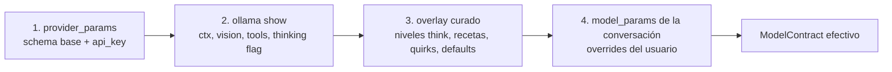

Reglas:

- El overlay es **sparse**: solo deltas (`num_ctx.max`, `temperature.default`, bloque `thinking`, `recipes`).
- `show` es fuente de verdad **cuando existe** (visión, tools, context_length).
- El overlay rellena lo que la API no expone: niveles de thinking, `can_disable`, recetas, quirks.
- Modelo sin overlay → Null Object: schema del proveedor + capabilities de `show` + sin recetas.
- No aplicar automáticamente `num_ctx = max`. 1M tokens en un “hola” duele en latencia y factura. Default razonable: 16k–32k; el max es techo del slider y de la receta “repo enorme”.

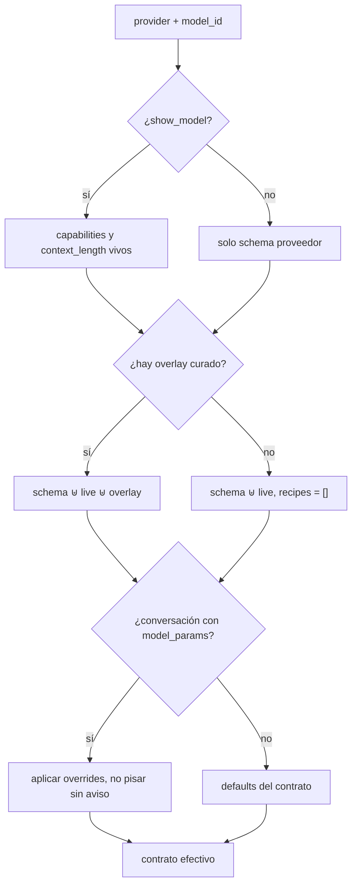

---

## 7. ChatRequestBuilder

```text
ChatIntent (mensaje, imágenes, receta, overrides)
        +
ModelContract (capabilities, params, thinking, quirks, recipes)
        ↓
ChatRequestBuilder
        ↓
extra_body + messages  →  LLMProvider.chat()
```

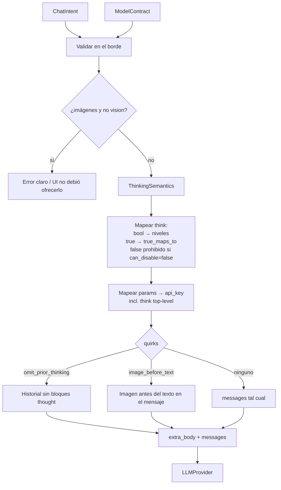

Políticas justificadas (no N adapters):

| Política | Casos | Dato en el contrato |
|----------|--------|---------------------|
| `ThinkingSemantics` | bool, niveles, always-on | `thinking.kind`, `values`, `can_disable`, `true_maps_to` |
| `HistoryQuirks` | Gemma: no reenviar thought | `quirks: ["omit_prior_thinking"]` |
| (futuro) `MultimodalOrder` | Gemma: imagen antes del texto | `quirks: ["image_before_text"]` |

`build_extra_body` debe resolver **el contrato efectivo**, no solo `get_params_config(provider)`.

---

## 8. UI: renderer del contrato, no formulario por modelo

Si se genera HTML distinto por modelo, se ha perdido.

Al cambiar de modelo, la UI pregunta al contrato:

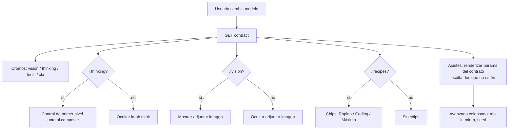

Reglas de interfaz:

1. **Cromos de capacidad** en el selector: el usuario elige modelo por lo que *hace*, no por el nombre.
2. **Thinking como control de primer nivel** (junto al composer), no enterrado en Ajustes. Es el knob de más impacto en cloud y hoy **no existe** en el código.
3. **Chips de receta** al cambiar de modelo. Aplican un set coherente. El experto abre Ajustes y desvía.
4. **Ajustes generados por schema**: se muestra el control si el param está en el contrato; si no, se **oculta** (no se deshabilita a medias como ahora).
5. **Adjuntar imagen** solo si `vision`. Adjuntar a GPT-OSS es un callejón sin salida.
6. **Progressive disclosure**: 3–4 knobs visibles (think, temperature, ctx, max tokens). El resto colapsado. Quince sliders no sacan partido: asustan y se dejan en default.

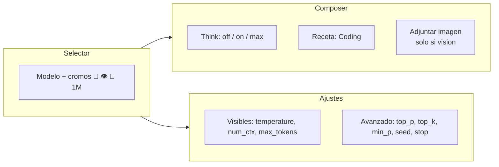

No auto-aplicar receta al cambiar de modelo **si la conversación ya tenía overrides**, sin avisar. Pisar el `temperature=0.2` afinado por el usuario es peor que un default mediocre.

---

## 9. Persistencia y API

La persistencia actual es la correcta: `model_params` como `dict` opaco por conversación. No un Pydantic distinto por modelo. El contrato valida en el borde; la conversación guarda `{param_id: value}`.

La ficha `model_info` (tags, uncensored, reglas) es **otra cosa**. No mezclarla con el contrato de runtime.

Endpoint propuesto:

```text
GET /api/providers/{provider}/models/{model_id}/contract
```

Una sola respuesta con la que se pinta la UI y con la que el backend valida y construye el payload.

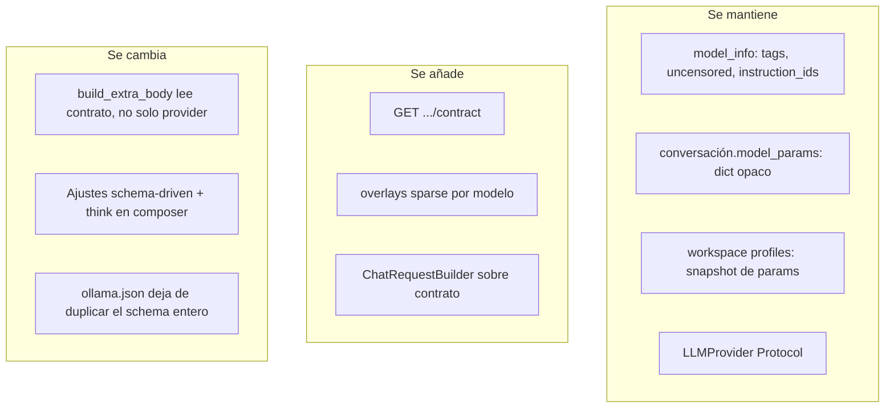

---

## 10. Matriz cloud → contrato (referencia)

Fuente: investigación en `docs/research/ollama-cloud/`.

| Modelo | Vision | Thinking | Tools | Ctx | Overlay mínimo |
|--------|--------|----------|-------|-----|----------------|
| `mistral-large-3:675b-cloud` | sí | no | sí | 256K | `num_ctx.max`, receta enterprise |
| `glm-5.3-flash:cloud` | sí | sí | sí | 1M | niveles think, ctx techo, recetas coding/visión |
| `gpt-oss:120b-cloud` | no | niveles low/med/high, no off | sí | 128K | `can_disable: false` |
| `gemma4:31b-cloud` | sí | sí | sí | 256K | `temperature` 1.0, quirk thought, imagen antes de texto |
| `deepseek-v4-flash:cloud` | no | false / true / max | sí | 1M | recetas fast/coding/hard |
| `kimi-k2.6:cloud` | sí | sí | sí | 256K | receta coding visual |
| `kimi-k3:cloud` | sí | hasta max | sí | 1M | receta “máxima calidad”; no default diario |
| `glm-5.2:cloud` | no | high / max | sí | 1M | legacy vs 5.3 |

Sacar partido **no** es exponer todos los flags de Ollama. Es:

- no enviar params que el modelo ignora o castiga (GPT-OSS + `think: false`);
- no ofrecer visión donde no hay;
- poner el knob correcto a un clic (thinking, receta);
- dejar el laboratorio (top-k, min-p, seed) para quien lo busca.

---

## 11. Qué no hacer

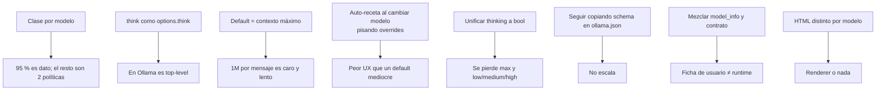

---

## 12. Relación con lo existente

| Pieza actual | Rol respecto a este diseño |
|--------------|----------------------------|
| `config/provider_params.json` | Capa 1 del merge: schema base por proveedor. Se queda. |
| `config/ollama.json` | Hoy: schema completo por modelo. Debe **adelgazar a overlay** (o un archivo `config/overlays/ollama.json`). |
| `app/provider_params.py` `build_extra_body` | Debe resolver contrato, no solo proveedor. |
| `app/providers/capabilities.py` | Capacidades **de proveedor** (`show_model`, `unload_model`). Distinto de capacidades **de modelo**. |
| `app/model_info.py` | Ficha usuario/proveedor. No es el contrato. Puede alimentar context_length vía `provider_info`. |
| `LLMProvider` + `extra_body` | Adapter correcto; el builder escribe `extra_body`. |
| Controles hardcodeados en `index.html` | Deuda de UI: pasar a renderer según `params` + `ui_group`. |
| Recetas vs botón “Cargar preset” | El preset actual carga un modelo entero. Las recetas son **perfiles de uso del modelo ya seleccionado**. No confundirlos. |

---

## 13. MVP sugerido

Objetivo: contrato + thinking + recetas + overlay. No redibujar todo el acordeón de golpe.

1. `ResolveModelContract` + `GET .../contract` (merge provider + show + overlay).
2. Overlay sparse para 2 modelos antagónicos: `gpt-oss:120b-cloud` y `deepseek-v4-flash:cloud`.
3. `build_extra_body` lee params del contrato (así `think` se envía).
4. Control thinking en el composer según `capabilities.thinking`.
5. Chips de receta; no pisar overrides existentes sin confirmación.
6. Ocultar adjuntar imagen si `vision: false`.
7. Tests unitarios del merge, del mapping de thinking y del builder (sin e2e salvo que se toque el endpoint de chat).

Fuera del MVP: renderer completo de Ajustes, overlays de todos los cloud, tools/MCP gated por `capabilities.tools`, coste estimado en UI.

---

## 14. Validación del schema (antes de implementar UI)

Bajar el contrato a esos dos modelos antagónicos y comprobar que aguanta:

| Pregunta | GPT-OSS | DeepSeek V4 Flash |
|----------|---------|-------------------|
| ¿Se puede apagar thinking? | No (`can_disable: false`) | Sí |
| Valores | `low` `medium` `high` | `false` `true` `max` |
| Visión | no → ocultar adjunto | no → ocultar adjunto |
| Ctx techo | 131072 | 1048576 |
| Receta “rápido” | `think: low` | `think: false` |
| Receta “difícil” | `think: high` | `think: max` |

Si el mismo JSON schema y el mismo renderer cubren ambos, el diseño vale. Si hace falta un `if model.startswith("gpt-oss")` en la UI, el contrato está incompleto.
