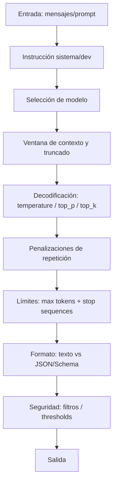

# Parámetros configurables en LLMs para usuarios no expertos

## Resumen ejecutivo

En los proveedores más usados (OpenAI, Anthropic/Claude, Hugging Face, Ollama y otros), los “mandos” realmente útiles para un usuario no experto se concentran en cinco grupos: **(a) selección de modelo**, **(b) cómo se formula la instrucción (system/dev + prompt)**, **(c) longitud y paradas (max tokens + stop sequences)**, **(d) aleatoriedad/diversidad (temperature, top_p/top_k y variantes)** y **(e) seguridad/formato (filtros y salida estructurada)**. Esta convergencia se ve en las referencias oficiales: OpenAI expone `model`, `instructions`, `max_output_tokens`, `temperature`, `top_p`, `stream` y estrategias de `truncation` en su Responses API; Anthropic en Messages usa `model`, `system`, `messages`, `max_tokens`, `temperature`, `top_k`, `top_p`, `stop_sequences` y `stream`; Hugging Face (Inference Providers) lista un conjunto amplio de `parameters` para generación (incluyendo `temperature`, `top_p`, `top_k`, `max_new_tokens`, `stop`, `seed` y `best_of`); Ollama permite ajustar “options” como `temperature`, `top_k`, `top_p`, `num_predict`, `num_ctx`, `seed`, `stop` (y más) tanto en runtime como en modelfiles. citeturn5view0turn38view0turn13view0turn14view0turn24view0turn25view0turn34view1

Para **usuarios no expertos**, una recomendación robusta es empezar por **tocar solo 3 cosas**:  
1) **`max_tokens`/`max_output_tokens`/equivalente** (para controlar longitud y coste), 2) **`temperature`** (creatividad vs determinismo) y 3) **instrucciones claras** (system/dev + prompt con formato esperado). La documentación de varios proveedores subraya que `temperature` y `top_p` son alternativas (se recomienda ajustar una u otra, no ambas a la vez) y que los límites máximos de tokens dependen del modelo. citeturn11view2turn38view0turn13view0turn22view0turn23view0turn39view0turn20view2

Cuando se necesita más control, los siguientes “niveles” suelen ser: **stop sequences** (evitar que el modelo se vaya por las ramas), **penalizaciones de repetición** (evitar bucles), **semilla (`seed`)** (reproducibilidad “mejor esfuerzo”), y **salida estructurada** (JSON/JSON Schema) para integraciones. Esto está explícito en: stop sequences y sus límites (por ejemplo OpenAI “hasta 4”, Gemini “hasta 5”, Cohere “hasta 5”), semillas, y modos JSON/Schema en OpenAI/Mistral/Cohere/Gemini, además de mecanismos equivalentes como `grammar` en Hugging Face o `format: json` en Ollama. citeturn11view0turn39view0turn20view0turn21view0turn26search1turn22view0turn24view0turn25view0

## Marco conceptual

Un LLM genera texto **token a token**: en cada paso decide la distribución de probabilidad del siguiente token y aplica una estrategia de decodificación. Por eso, muchos parámetros “clásicos” son variantes de **cómo se recorta o repondera esa distribución**:  
- `temperature` modifica el grado de aleatoriedad (temperaturas bajas → respuestas más deterministas; altas → más variedad). citeturn23view0turn11view2turn14view0turn20view2  
- `top_p` (nucleus sampling) limita la masa acumulada de probabilidad considerada; `top_k` limita el número de candidatos; y varios proveedores recomiendan ajustar **temperature o top_p**, pero no ambos simultáneamente. citeturn23view0turn11view2turn14view1turn20view2  

Esta mecánica explica un patrón práctico: **cuanto más “abierta” sea la decodificación** (temperature alta, top_p alto, top_k alto), más probable es que el modelo produzca variantes creativas; pero, como inferencia razonable, también aumenta el riesgo de desviarse del objetivo o introducir errores en tareas factuales (porque se permite más exploración dentro del espacio de tokens). Esta relación se apoya en las descripciones oficiales de “más aleatorio” vs “más determinista” cuando se sube/baja `temperature` y se ensancha/estrecha el conjunto de candidatos con top-k/top-p. citeturn23view0turn11view2turn20view3



## Catálogo de parámetros configurables

En cada parámetro incluyo: **definición**, **rango y defaults (cuando están documentados)**, **efecto observable**, **ejemplos**, **casos recomendados**, **limitaciones/riesgos**, y **compatibilidad con nombres de campo**. Cuando un valor por defecto o un límite no aparece en documentación oficial consultada, lo marco como **“no especificado”**.

### Selección de modelo y “espacio de trabajo” del contexto

**Selección de modelo (`model`)**  
Definición: Identificador del modelo a usar; cambia calidad, latencia, precio, capacidades (herramientas, multimodalidad) y, críticamente, **límites de contexto y salida**. OpenAI lo expone como `model` en Responses; Cohere, Mistral, Anthropic y Ollama también requieren `model` en sus endpoints; Gemini requiere el nombre del modelo en el path `models/{model}`. citeturn5view0turn21view0turn22view0turn13view0turn25view0turn18view0  
Rango/valores: depende del catálogo del proveedor; **no especificado** como rango numérico.  
Efecto observable: a igualdad de prompts/parámetros, distintos modelos producen distinta calidad/estilo y permiten distintos parámetros (por ejemplo algunos no admiten ciertas opciones). Gemini indica explícitamente que “no todos los parámetros son configurables para cada modelo” en `GenerationConfig`. citeturn20view0  
Ejemplo: cambiar de un modelo “rápido” a uno “más capaz” para tareas de razonamiento o extracción estructurada. (La elección concreta depende del catálogo vigente del proveedor; no es estable en el tiempo.)  
Riesgos: escoger un modelo sin soporte de un parámetro o con ventana de contexto insuficiente puede causar errores por límite de tokens. Gemini y Mistral remarcan que los límites dependen del modelo y/o su longitud de contexto. citeturn20view2turn22view0  
Compatibilidad (campo API):  
- OpenAI: `model` (Responses y Chat/Completions). citeturn5view0turn9view8turn39view0  
- Anthropic: `model`. citeturn13view0  
- Hugging Face (Inference Providers): `model` (dependiendo de modalidad/cliente; en la especificación del task se usa `inputs` + `parameters`, y el modelo va por endpoint/provider). citeturn24view0  
- Ollama: `model`. citeturn25view0  
- Cohere: `model`. citeturn21view0  
- entity["company","Mistral AI","llm provider"]: `model`. citeturn22view0  
- entity["company","Google","technology company"] (Gemini API): `model` en el path `models/{model}`. citeturn18view0  

**Instrucciones de sistema / developer / rol (“system prompt”)**  
Definición: Texto de alto nivel que fija objetivos, estilo, restricciones, formato y “reglas del juego” para el modelo. Anthropic enfatiza que en su Messages API **no existe rol `"system"` dentro de `messages`**: el system prompt va en el parámetro top-level `system`. citeturn13view0turn14view3  
En OpenAI Responses existe `instructions` como “system (o developer) message” insertado en el contexto. citeturn5view0  
En Gemini existe `systemInstruction` (developer set system instruction(s)). citeturn18view0turn19view9  
Efecto observable: suele dominar el estilo y el formato; reduce ambigüedad; ayuda a que parámetros de formato (JSON/Schema) funcionen de manera fiable al combinarse con instrucciones explícitas. Mistral, Cohere y OpenAI advierten (con matices) que al forzar JSON conviene **instruir explícitamente** al modelo para evitar salidas problemáticas. citeturn22view0turn21view0turn26search1  
Ejemplo: “Responde en español, con lista corta, y si no estás seguro di ‘no especificado’.”  
Riesgos: instrucciones demasiado largas consumen contexto; instrucciones contradictorias generan incoherencia. (Inferencia razonable: al aumentar conflicto interno, se degradan resultados.)  
Compatibilidad (campo API):  
- OpenAI Responses: `instructions`. citeturn5view0  
- OpenAI Chat Completions: mensaje con rol `developer`/`system` dentro de `messages` (documentado indirectamente por el mapeo de Bedrock para roles y por ejemplos de `messages`). citeturn23view1turn9view8  
- Anthropic: `system`. citeturn13view0turn14view3  
- Gemini API: `systemInstruction`. citeturn18view0turn19view9  
- Ollama: `messages[].role = system` (chat) o `SYSTEM ...` en Modelfile. citeturn25view0turn34view2  
- Cohere: mensajes con rol `System` dentro de `messages`. citeturn21view0  
- Mistral: `messages` incluye `SystemMessage`. citeturn22view0  
- Hugging Face: depende del formato (text-generation usa `inputs`; chat-completion task usa mensajes). En Transformers se controla por prompt; en Ollama/otros puede haber plantillas. citeturn24view0turn27view0turn34view2  

**Mensajes / prompt de usuario (`messages`, `input`, `contents`, `prompt`, `inputs`)**  
Definición: el contenido principal que el usuario envía (pregunta, tarea, datos). Varía por API: OpenAI Responses usa `input`; OpenAI Chat usa `messages`; Anthropic usa `messages`; Gemini usa `contents`; Ollama chat usa `messages` y generate usa `prompt`; HF text-generation usa `inputs`. citeturn5view0turn9view8turn13view0turn18view0turn25view0turn24view0  
Efecto observable: la calidad del prompt suele dominar el resultado más que microajustes de sampling. (Esto es una regla empírica; aquí se presenta como recomendación práctica, no como hecho universal.)  
Riesgos: prompts ambiguos → respuestas ambiguas; prompts largos → consumo de contexto y truncados/errores. OpenAI Responses documenta comportamiento ante exceso de contexto vía `truncation`. citeturn38view0  

**Ventana de contexto / truncado del input (`truncation`, `truncate`, `num_ctx`)**  
Definición: controla qué pasa cuando el input excede la ventana de contexto del modelo: o bien falla, o bien se recorta, o se configura el tamaño (en sistemas locales).  
- OpenAI Responses: `truncation` decide si se recortan items antiguos (`auto`) o si falla (`disabled`, por defecto). citeturn38view0  
- Hugging Face Inference Providers: `truncate` permite truncar tokens de entrada a un tamaño dado. citeturn24view0  
- Ollama: `num_ctx` define el tamaño de la ventana de contexto (default 2048) y es ajustable en Modelfile o en `options`. citeturn34view1turn25view0  
Rango/defaults:  
- OpenAI Responses `truncation`: `auto` o `disabled` (default `disabled`). citeturn38view0  
- HF `truncate`: entero (default no indicado). citeturn24view0  
- Ollama `num_ctx`: entero (default 2048). citeturn34view1  
Efecto observable: si se recorta el contexto, el modelo puede “olvidar” instrucciones o datos anteriores; si se forza fallo, se detecta temprano el problema y se obliga a resumir/compactar manualmente. OpenAI lo explica explícitamente como “dropping items from the beginning of the conversation” en modo `auto`. citeturn38view0  
Casos recomendados:  
- `disabled`/fallo: backends críticos donde no se permite perder contexto sin control. citeturn38view0  
- `auto`/truncado: UIs conversacionales donde se prefiere continuidad aunque se pierda historial. citeturn38view0  
Riesgos: truncar sin estrategia de resumen puede causar respuestas incorrectas por falta de datos. (Inferencia apoyada por el hecho de que se “dropping items”.) citeturn38view0  

### Control de aleatoriedad y diversidad

**Temperatura (`temperature`)**  
Definición: parámetro de muestreo que controla aleatoriedad. OpenAI lo define como valor entre 0 y 2; Anthropic lo define entre 0 y 1 con default 1.0; Gemini lo define entre 0 y 2 y advierte que el default varía por modelo; Ollama documenta `temperature` con default 0.8; Cohere usa `temperature` con default 0.3; Mistral recomienda 0.0–0.7 y dice que el default varía por modelo. citeturn11view2turn14view0turn20view2turn34view1turn21view0turn22view0turn37view1  
Rango típico: 0–2 (muchos proveedores) o 0–1 (Anthropic). citeturn11view2turn14view0turn20view2  
Defaults (oficial):  
- OpenAI Responses: `temperature` default 1. citeturn37view1  
- OpenAI Chat/Completions: default **no especificado** en la referencia consultada (sí se documenta el rango). citeturn11view2turn39view0  
- Anthropic Messages: default 1.0. citeturn14view0  
- Cohere Chat v2: default 0.3. citeturn21view0  
- Mistral: default varía según modelo (consultar `/models`). citeturn22view0  
- Gemini: default varía según modelo (`Model.temperature`). citeturn20view2  
- Ollama: default 0.8. citeturn34view1  
Efecto práctico:  
- Baja (≈0–0.2): respuestas más consistentes y “centradas”. citeturn11view2turn14view0turn23view0  
- Media (≈0.3–0.7): balance en redacción general; Mistral recomienda ese intervalo. citeturn22view0  
- Alta (≈0.8–1.2+): más creatividad/variación pero más dispersión (inferido desde “más random”). citeturn11view2turn23view0turn34view1  
Ejemplos:  
- Cohere (determinismo moderado): `temperature: 0.2`. citeturn21view0  
- Ollama (creatividad): `temperature: 1.0` en Modelfile o `options`. citeturn33view1turn34view1turn25view0  
Riesgos: temperaturas altas pueden aumentar variabilidad; en tareas factuales, es razonable esperar más fallos (inferencia apoyada por “más random”). citeturn23view0turn11view2  
Compatibilidad (campo): casi universal como `temperature` (Gemini usa `generationConfig.temperature`). citeturn11view2turn14view0turn20view2turn21view0turn22view0turn24view0turn34view1turn37view1  

**Top‑p / nucleus sampling (`top_p`, `topP`, `p`)**  
Definición: restringe candidatos a la masa acumulada `p`. OpenAI y Anthropic describen explícitamente top‑p y recomiendan ajustar `temperature` o `top_p` pero no ambos. Gemini documenta `topP` y explica combinación con top‑k. Mistral usa `top_p` (default 1). Cohere usa `p` (default 0.75) y señala que aumentar `p` maximiza aleatoriedad junto con temperatura. citeturn11view3turn14view1turn20view2turn22view0turn21view0turn38view0  
Rango típico: 0–1 (aunque algunos tratan 1 como “sin recorte”). citeturn38view0turn14view1turn39view0turn22view0  
Defaults (oficial):  
- OpenAI Responses: `top_p` default 1. citeturn37view1turn38view0  
- Mistral: `top_p` default 1. citeturn22view0  
- Cohere: `p` default 0.75 (rango 0.01–0.99). citeturn21view0  
- Gemini: default varía por modelo (`Model.top_p`). citeturn20view2  
- Ollama: `top_p` default 0.9. citeturn34view1  
- Transformers (Hugging Face): si no está en `generation_config.json`, default 1.0. citeturn27view0  
Efecto práctico: bajar top‑p suele hacer el output más conservador; subirlo permite más diversidad. Esto está descrito en el sentido de “considera la masa de probabilidad top_p”. citeturn38view0turn23view0turn34view1  
Ejemplo concreto: Ollama recomienda valores como 0.5 (más conservador) vs 0.95 (más diverso) en su referencia de parámetros. citeturn34view1  
Riesgos: top‑p muy bajo puede generar respuestas excesivamente rígidas o repetitivas; top‑p alto combinado con temperatura alta tiende a aumentar deriva (inferencia coherente con “pool más amplio”). citeturn23view0turn21view0turn38view0  
Compatibilidad (campo):  
- OpenAI: `top_p` (Responses/Chat/Completions). citeturn38view0turn39view0  
- Anthropic: `top_p`. citeturn14view1  
- Cohere: `p`. citeturn21view0  
- Gemini: `generationConfig.topP`. citeturn20view2  
- Mistral: `top_p`. citeturn22view0  
- Ollama: `options.top_p`. citeturn25view0turn34view1  
- Hugging Face Inference Providers: `parameters.top_p`. citeturn24view0  

**Top‑k (`top_k`, `topK`, `k`)**  
Definición: limita el número de tokens candidatos a los K más probables. AWS Bedrock y Gemini documentan top‑k como “pool size”; Anthropic lo ofrece como `top_k`; Cohere lo ofrece como `k` (0–500, default 0 desactiva); Ollama documenta `top_k` (default 40). citeturn23view0turn20view2turn14view2turn21view0turn34view1turn24view0  
Defaults (oficial): varía mucho: Cohere `k=0` default (desactivado), Ollama `top_k=40` default; Transformers default 50 si no está especificado. citeturn21view0turn34view1turn27view0  
Efecto práctico: top‑k bajo restringe variedad; alto permite más tokens raros (y potencialmente “nonsense”, como advierte Ollama). citeturn34view1turn23view0  
Compatibilidad: campo cambia por proveedor (`topK`, `k`, `top_k`). citeturn20view2turn21view0turn34view1turn24view0turn14view2  

**`min_p` / muestreo mínimo (`min_p`, `minP`)**  
Definición: filtro alternativo a top‑p, basado en una probabilidad mínima relativa al token más probable. Está documentado en Transformers (Hugging Face) con rangos típicos 0.01–0.2 y en Ollama con default 0.0; también aparece en el ejemplo de opciones del API de Ollama. citeturn27view0turn34view1turn25view0  
Para no expertos: suele ser “avanzado”; tocarlo solo si hay repetición o incoherencia y ya probaste con `temperature/top_p/top_k`.  
Compatibilidad: Ollama `min_p`; HF/Transformers `min_p`; Gemini no lo expone como tal en GenerationConfig; OpenAI/Anthropic/Cohere/Mistral no lo listan como parámetro estándar. citeturn34view1turn27view0turn20view0turn21view0turn22view0turn38view0  

**`typical_p`, `tfs_z`, `mirostat*` (Ollama y ecosistema open‑source)**  
Definición: técnicas de muestreo más avanzadas para controlar diversidad y “calidad percibida”; Ollama documenta `tfs_z` (default 1) y `mirostat*` (y también muestra `typical_p` en ejemplos). citeturn34view1turn25view0  
Para no expertos: considerarlas “segundo escalón” y cambiar **una por vez**, porque su interacción es menos intuitiva que `temperature/top_p`. (Recomendación práctica.)  
Compatibilidad: esencialmente Ollama (y algunas implementaciones open-source), no en APIs comerciales estándar listadas aquí. citeturn25view0turn34view1  

### Longitud, cortes y coste

**Límite de tokens de salida (`max_tokens`, `max_output_tokens`, `max_completion_tokens`, `max_new_tokens`, `num_predict`, `maxOutputTokens`)**  
Definición: techo duro de tokens generados (a veces incluye tokens “internos” de razonamiento).  
- OpenAI Responses: `max_output_tokens` limita tokens de salida (incluye tokens visibles y “reasoning tokens”). citeturn5view0  
- OpenAI Chat Completions: `max_completion_tokens` es el límite nuevo; `max_tokens` está deprecado y no es compatible con algunos modelos de razonamiento. citeturn9view3turn36view6  
- Anthropic Messages: `max_tokens` es “máximo absoluto” antes de parar; el máximo permitido depende del modelo. citeturn13view0  
- Cohere: `max_tokens` por defecto es el máximo de salida del modelo; si se pasa un valor mayor, se capará al máximo del modelo. citeturn21view0  
- Mistral: `max_tokens` y el prompt juntos no pueden exceder la longitud de contexto del modelo. citeturn22view0  
- Gemini: `generationConfig.maxOutputTokens` y su default varía por modelo (`Model.output_token_limit`). citeturn20view1turn20view2  
- Hugging Face Inference Providers: `max_new_tokens` como máximo de tokens generados. citeturn24view0  
- Ollama: `num_predict` (default 128; -1 infinito; -2 “fill context”). citeturn34view1turn25view0  
Efecto práctico: controla coste y evita respuestas demasiado largas; si queda bajo, aumenta riesgo de truncado de respuesta (incompleta). Cohere lo advierte explícitamente (“Setting a low value may result in incomplete generations”). citeturn21view0  
Ejemplos:  
- Gemini: `maxOutputTokens: 200` para una respuesta breve. citeturn20view1turn19view2  
- Ollama: `num_predict: 64` para respuestas cortas en local. citeturn34view1turn25view0  
Riesgos: confundir “tokens” con “palabras”; cada proveedor advierte que los límites dependen del modelo/contexto. citeturn13view0turn22view0turn20view2turn39view0  

**Stop sequences (`stop`, `stop_sequences`, `stopSequences`)**  
Definición: secuencias de caracteres que, si aparecen, detienen la generación y no se incluyen en el texto devuelto (según proveedor).  
- OpenAI: `stop` acepta string o array; hasta 4 secuencias; no soportado con algunos modelos de razonamiento recientes. citeturn11view0turn39view0  
- Anthropic: `stop_sequences` como lista para detener en cadenas personalizadas (no se documenta un máximo aquí → **no especificado**). citeturn14view3turn14view8  
- Cohere: `stop_sequences` hasta 5. citeturn21view0  
- Gemini: `stopSequences` hasta 5. citeturn20view0  
- Hugging Face Inference Providers: `stop` como `string[]` (sin límite documentado aquí → **no especificado**). citeturn24view0  
- Ollama: `stop` puede ser múltiple (Modelfile permite múltiples `PARAMETER stop ...`; en runtime se pasa lista en `options.stop`). citeturn34view1turn25view0  
- Mistral: `stop` string|array<string> (límite no especificado). citeturn22view0  
Efecto práctico: útil para cortar listas, cortar en “\n\nUsuario:” o terminar al cerrar un JSON. Si se usan mal, pueden cortar demasiado pronto (especialmente con cadenas cortas).  
Ejemplo: cortar al detectar `"\nUsuario:"` en chat logs. Ollama muestra `stop: ["\n", "user:"]` en su ejemplo. citeturn25view0  
Riesgos: stop sequences demasiado genéricas (p. ej. “.”) pueden truncar casi todas las frases (inferencia práctica).  

### Penalizaciones y control de repetición

**Presence penalty (`presence_penalty`, `presencePenalty`)**  
Definición: penaliza tokens que ya han aparecido para fomentar vocabulario nuevo. OpenAI Chat/Completions lo lista con rango -2..2; Gemini define `presencePenalty` como binaria (aplicada si el token ya apareció) y sugiere usar `frequencyPenalty` para un castigo proporcional a repeticiones; Cohere define `presence_penalty` 0–1 con default 0.0; Mistral define `presence_penalty` default 0. citeturn36view2turn20view3turn21view0turn22view0  
Defaults: varían y/o no siempre están especificados; Cohere y Mistral sí listan default 0. citeturn21view0turn22view0  
Efecto práctico: reduce repeticiones y empuja a “temas nuevos”; la propia definición de OpenAI lo describe como aumentar probabilidad de hablar de nuevos temas. citeturn36view2  
Riesgos: valores demasiado altos pueden forzar saltos temáticos o pérdida de cohesión (inferencia basada en “encourage new topics”). citeturn36view2  
Compatibilidad:  
- OpenAI: `presence_penalty` (Chat/Completions). citeturn36view2turn39view0  
- Gemini: `presencePenalty`. citeturn20view3  
- Cohere: `presence_penalty`. citeturn21view0  
- Mistral: `presence_penalty`. citeturn22view0  
- Ollama: aparece como `presence_penalty` en ejemplo de options (no está en la tabla de defaults del Modelfile → **no especificado** el default). citeturn25view0turn34view1  
- HF Inference Providers: no lo lista como `presence_penalty` en text-generation; sí lista `frequency_penalty`. citeturn24view0  

**Frequency penalty (`frequency_penalty`, `frequencyPenalty`)**  
Definición: penaliza tokens en proporción a su frecuencia previa. OpenAI Chat/Completions lo define -2..2; Gemini lo define como proporcional al número de veces usado; Cohere lo define 0..1 con default 0.0; Mistral `frequency_penalty` default 0. citeturn36view2turn20view4turn21view0turn22view0  
Efecto: reduce bucles y repeticiones verbatim. OpenAI lo describe explícitamente como “decreasing likelihood to repeat the same line verbatim”. citeturn36view4  
Riesgos: penalizaciones negativas (Gemini advierte) pueden empujar a repetición masiva hasta el límite de tokens. citeturn20view4  

**Repetition penalty (`repetition_penalty`, `repeat_penalty`, `repeat_last_n`, `no_repeat_ngram_size`)**  
Definición: familia de controles comunes en open-source.  
- Transformers: `repetition_penalty` (1.0 = sin penalización). citeturn27view0  
- HF Inference Providers: `repetition_penalty` en `parameters`. citeturn24view0  
- Ollama: `repeat_penalty` (default 1.1) y `repeat_last_n` (default 64). citeturn34view1  
Efecto: reduce repeticiones persistentes, especialmente en modelos pequeños o prompts muy guiados.  
Riesgos: si se sube demasiado, puede empeorar fluidez o forzar sinónimos raros (inferencia práctica).  

### Determinismo y reproducibilidad

**Semilla (`seed`, `random_seed`)**  
Definición: fija el generador pseudoaleatorio para intentar reproducibilidad.  
- OpenAI (Completions): `seed` “best effort” determinista; no garantizado; usar `system_fingerprint` para monitorizar cambios de backend. citeturn39view0  
- OpenAI (Chat Completions): `seed` aparece como deprecado/beta; determinismo no garantizado. citeturn9view7  
- Cohere: `seed` con rango enorme; también “best effort” determinista. citeturn21view0  
- Gemini: `seed` si no se seta, usa una semilla aleatoria. citeturn20view3  
- HF Inference Providers: `seed` para muestreo. citeturn24view0  
- Ollama: `seed` default 0; fijarla hace que el modelo genere el mismo texto para el mismo prompt (según su doc). citeturn34view1turn25view0  
- Mistral: `random_seed` (determinismo si se fija). citeturn22view0  
Riesgos: incluso con seed fija, varios proveedores avisan explícitamente que **no garantizan** determinismo absoluto. citeturn39view0turn21view0turn9view7  

### Múltiples candidatos y “mejor de N”

**Número de salidas (`n`, `candidateCount`)**  
Definición: genera varias respuestas para el mismo input.  
- OpenAI Chat Completions: `n` (1–128) y se advierte que se factura por tokens generados en todas las opciones. citeturn36view5  
- Mistral: `n` (número de completions). citeturn22view0  
- Gemini: `candidateCount` default 1. citeturn20view1  
Efecto práctico: permite elegir la mejor respuesta con heurísticas (p. ej. validación JSON, scoring, etc.).  
Riesgos: coste y latencia aumentan proporcionalmente (OpenAI lo advierte sobre coste y facturación por tokens). citeturn36view5  

**Best-of (`best_of`)**  
Definición: genera varias candidatas en el servidor y devuelve la “mejor” según logprob promedio.  
- OpenAI Completions (legacy): `best_of` (0–20), no admite streaming, y debe ser ≥ `n`; se advierte del consumo de cuota. citeturn39view0  
- Hugging Face Inference Providers: incluye `best_of` y devuelve detalles de secuencias. citeturn24view0  
En no expertos: es útil cuando se necesita calidad sin lógica propia de reranking, pero hay que vigilar coste y no se combina con streaming en OpenAI Completions. citeturn39view0  

### Streaming y entrega incremental

**Streaming (`stream`)**  
Definición: devuelve tokens/partes conforme se generan (SSE).  
- OpenAI Responses: `stream` default false. citeturn37view1  
- OpenAI Chat Completions/Completions: `stream` existe. citeturn11view0turn39view0  
- Anthropic: `stream` boolean. citeturn14view3  
- Cohere: `stream` requerido, default false; cuando true, SSE. citeturn21view0  
- Mistral: `stream` default false; SSE. citeturn22view0  
- HF Inference Providers: `stream` boolean; SSE cuando true. citeturn24view0  
- Ollama: endpoints son “streaming” por defecto y se puede desactivar con `"stream": false`. citeturn25view0  
Efecto práctico: mejora UX en chat; no cambia necesariamente la “calidad final” pero sí la latencia percibida.  
Riesgos: manejar interrupciones; algunos proveedores añaden opciones extra (OpenAI `stream_options`). citeturn11view0turn39view0turn37view1  

### Observabilidad y depuración

**Logprobs (`logprobs`, `top_logprobs`, `responseLogprobs`)**  
Definición: devuelve probabilidades logarítmicas de tokens generados (y top alternativas).  
- OpenAI Chat Completions: `logprobs` boolean; `top_logprobs` 0–20 (requiere `logprobs=true`). citeturn36view6turn10view3  
- OpenAI Responses: tiene `top_logprobs` 0–20 y se puede incluir logprobs en salida pidiendo `include` para `message.output_text.logprobs`. citeturn5view0turn38view0  
- OpenAI Completions (legacy): `logprobs` es numérico con máximo 5. citeturn39view0  
- Gemini: `responseLogprobs` boolean y `logprobs` 0–20. citeturn20view4  
- Cohere: `logprobs` boolean (default false). citeturn21view0  
- HF Inference Providers: el response puede incluir tokens con `logprob` en detalles, y hay flags como `details`/`decoder_input_details`. citeturn24view0  
Uso recomendado: debugging de por qué el modelo eligió una palabra, detección de incertidumbre token-a-token y filtros de calidad (p. ej. si logprob cae mucho).  
Riesgos: más payload y coste de ancho de banda; no equivale a “certeza factual” (un token muy probable puede ser falso si el modelo está sesgado). (Inferencia conceptual; el logprob se refiere a probabilidad del modelo, no a verdad.) citeturn36view6turn20view4turn24view0  

### Formato de salida y estructuración

**Salida estructurada / JSON (`response_format`, `text.format`, `responseMimeType/responseSchema`, `grammar`, `format`)**  
Definición: fuerza al modelo a emitir texto plano o JSON (y a veces JSON Schema).  
- OpenAI Chat Completions: `response_format` soporta `json_schema`, `json_object` y `text`. citeturn10view8turn12view0  
- OpenAI guía Structured Outputs: para JSON mode en Chat Completions se usa `response_format: {type:"json_object"}` y en Responses se usa `text.format: {type:"json_object"}`; también indica que con function calling el JSON mode está “siempre activado”. citeturn26search1  
- Gemini: `responseMimeType` soporta `application/json` y `text/plain` (default) y además `responseSchema`/JSON schema con limitaciones de features. citeturn20view0turn20view1  
- Cohere: `response_format` puede forzar JSON object y aceptar JSON Schema; advierte limitaciones y que el mensaje debe instruir explícitamente JSON para evitar comportamientos no deseados. citeturn21view0  
- Mistral: `response_format` soporta `text`, `json_object`, `json_schema` y advierte que en JSON mode debes instruirlo explícitamente. citeturn22view0  
- Hugging Face Inference Providers: `grammar` permite `json`, `regex` y `json_schema`. citeturn24view0  
- Ollama chat: parámetro avanzado `format` y hoy “solo acepta `json`”. citeturn25view0  
Efecto práctico: aumenta robustez de integraciones (parsing), reduce prompts tipo “devuélveme un JSON válido” que fallan en edge-cases.  
Riesgos:  
- Si el modelo no soporta el modo, puede ignorarlo o fallar. Gemini indica que no todos los parámetros aplican a todos los modelos. citeturn20view0  
- JSON mode sin buena instrucción puede producir salidas problemáticas (Mistral/Cohere/OpenAI lo advierten con matices). citeturn22view0turn21view0turn26search1  

### Seguridad y filtros

**Ajustes de seguridad (`safetySettings`, `safety_mode`, `safe_prompt`, guardrails)**  
Definición: mecanismos para bloquear o moderar contenido (según categorías y umbrales), o añadir prompts de seguridad.  
- Gemini: `safetySettings[]` permite configurar umbrales por categoría; si no se provee una categoría, se usa el default. citeturn18view0  
- Cohere: `safety_mode` (default CONTEXTUAL; OFF omite instrucción de seguridad) y notas de compatibilidad con modelos/herramientas. citeturn21view0  
- Mistral: `safe_prompt` boolean (default false) para inyectar un safety prompt previo. citeturn22view0  
- entity["organization","Amazon Bedrock","managed foundation models"]: soporta “Guardrails” (aplicación vía headers en operaciones de invocación, según su doc para modelos OpenAI en Bedrock). citeturn23view1  
Efecto práctico: reduce probabilidad de outputs no deseados; puede aumentar rechazos o respuestas genéricas en categorías sensibles. (Inferencia razonable dado que “blocking unsafe content”.) citeturn18view0turn21view0  
Riesgos: falsos positivos (bloqueo de contenido legítimo), incompatibilidades con tools (Cohere lo nota). citeturn21view0  

## Compatibilidad por proveedor

La tabla resume **parámetros comunes** (no todos) con **nombres exactos** y notas de límites. Está construida a partir de documentación oficial de cada proveedor: OpenAI (Responses/Chat/Completions), Anthropic (Messages), Hugging Face (Inference Providers), Ollama (API + Modelfile), Cohere (Chat v2), Mistral (Chat), Gemini (generateContent), y Bedrock (inference parameters + mapping). citeturn38view0turn11view0turn39view0turn13view0turn24view0turn25view0turn34view1turn21view0turn22view0turn20view0turn23view0turn23view1

| Proveedor / API | Modelo | Prompt / mensajes | System / instrucciones | Longitud salida | Temperature | Top‑p | Top‑k | Stop sequences | Seed | Streaming | Logprobs | Salida estructurada | Notas de límites |
|---|---|---|---|---|---|---|---|---|---|---|---|---|---|
| OpenAI (Responses) | `model` | `input` | `instructions` | `max_output_tokens` | `temperature` | `top_p` | — | — | — | `stream` | `top_logprobs` + `include` | `text.format` | `truncation: auto|disabled` |
| OpenAI (Chat Completions) | `model` | `messages` | rol `developer/system` en `messages` | `max_completion_tokens` (y `max_tokens` deprecado) | `temperature` | `top_p` | — | `stop` (≤4; no en algunos modelos) | `seed` (deprecado/beta) | `stream` | `logprobs` + `top_logprobs` | `response_format` | `n` (1–128) |
| OpenAI (Completions legacy) | `model` | `prompt` | — | `max_tokens` | `temperature` | `top_p` | — | `stop` (≤4) | `seed` | `stream` | `logprobs` (≤5) | — | `best_of` (≤20), `n` |
| Anthropic (Messages) | `model` | `messages` | `system` (top-level) | `max_tokens` | `temperature` (0–1, default 1.0) | `top_p` | `top_k` | `stop_sequences` | — | `stream` | — | (vía tools/format no central aquí) | máximos dependen de modelo |
| Hugging Face (Inference Providers, text-generation) | (endpoint/provider) | `inputs` | (por prompt) | `max_new_tokens` | `parameters.temperature` | `parameters.top_p` | `parameters.top_k` | `parameters.stop[]` | `parameters.seed` | `stream` | `details` + tokens/logprob | `grammar` (json/regex/json_schema) | `best_of`, `truncate` |
| Ollama (local) | `model` | `/api/chat: messages` o `/api/generate: prompt` | `messages[].role=system` o `SYSTEM` en Modelfile | `options.num_predict` | `options.temperature` | `options.top_p` | `options.top_k` | `options.stop[]` | `options.seed` | `stream` (default streaming) | — | `format: json` | `num_ctx` (default 2048) |
| Cohere (Chat v2) | `model` | `messages` | rol `System` en mensajes | `max_tokens` | `temperature` (default 0.3) | `p` (default 0.75) | `k` (default 0) | `stop_sequences` (≤5) | `seed` | `stream` (default false) | `logprobs` | `response_format` (json_object/json_schema) | `safety_mode` |
| Mistral (Chat) | `model` | `messages` | `SystemMessage` | `max_tokens` | `temperature` (default varía) | `top_p` (default 1) | — | `stop` | `random_seed` | `stream` | — | `response_format` | `safe_prompt` |
| Gemini API | modelo en path | `contents[]` | `systemInstruction` | `generationConfig.maxOutputTokens` | `generationConfig.temperature` | `generationConfig.topP` | `generationConfig.topK` | `generationConfig.stopSequences` (≤5) | `generationConfig.seed` | (no `stream` en este método) | `responseLogprobs` + `logprobs` | `responseMimeType` + `responseSchema` | defaults dependen de `Model.*` |
| Amazon Bedrock (genérico) | `modelId` | `messages` en Converse | (depende del modelo) | `inferenceConfig.maxTokens` | `inferenceConfig.temperature` | `inferenceConfig.topP` | (según modelo) | `stopSequences` (según modelo) | (según modelo) | ConverseStream | (según modelo) | Guardrails y más | defaults dependen del modelo |

## Ejemplos de llamadas API por proveedor

Los ejemplos buscan ser **mínimos** y mostrar “dónde” se ajustan los parámetros (no cubren auth avanzada, retries, etc.). Cada snippet deriva de las referencias oficiales del endpoint correspondiente. citeturn38view0turn10view8turn13view0turn24view0turn25view0turn21view0turn22view0turn18view0turn23view1

### OpenAI Responses API (curl)

```bash
curl https://api.openai.com/v1/responses \
  -H "Content-Type: application/json" \
  -H "Authorization: Bearer $OPENAI_API_KEY" \
  -d '{
    "model": "gpt-4.1",
    "instructions": "Responde en español y devuelve JSON válido con keys: resumen, puntos.",
    "input": "Explica qué es top_p en 2 frases.",
    "max_output_tokens": 200,
    "temperature": 0.2,
    "top_p": 1.0,
    "truncation": "disabled",
    "stream": false,
    "text": { "format": { "type": "text" } }
  }'
```

Este ejemplo usa `instructions`, `max_output_tokens`, `temperature`, `top_p`, `truncation` y `stream`, todos documentados en Responses. citeturn5view0turn38view0turn37view1

### OpenAI Chat Completions (curl)

```bash
curl https://api.openai.com/v1/chat/completions \
  -H "Content-Type: application/json" \
  -H "Authorization: Bearer $OPENAI_API_KEY" \
  -d '{
    "model": "VAR_chat_model_id",
    "messages": [
      { "role": "developer", "content": "Contesta breve y sin relleno." },
      { "role": "user", "content": "Dame 3 ideas de titulares sobre IA en educación." }
    ],
    "max_completion_tokens": 120,
    "temperature": 0.7,
    "top_p": 1.0,
    "stop": ["\n\n"],
    "logprobs": true,
    "top_logprobs": 3,
    "stream": false,
    "response_format": { "type": "text" }
  }'
```

`max_completion_tokens` reemplaza a `max_tokens` (deprecado) y `stop` tiene restricciones en modelos recientes; `logprobs/top_logprobs` se documentan en la referencia. citeturn9view3turn11view0turn36view6turn10view3turn10view8turn9view8

### Anthropic Messages API (curl)

```bash
curl https://api.anthropic.com/v1/messages \
  -H "Content-Type: application/json" \
  -H "x-api-key: $ANTHROPIC_API_KEY" \
  -H "anthropic-version: 2023-06-01" \
  -d '{
    "model": "claude-3-7-sonnet-latest",
    "system": "Responde en español, con listas cortas.",
    "messages": [
      { "role": "user", "content": "¿Qué hace el parámetro temperature?" }
    ],
    "max_tokens": 200,
    "temperature": 0.2,
    "top_p": 1.0,
    "top_k": 0,
    "stop_sequences": ["\n\n"]
  }'
```

Anthropic documenta `max_tokens`, `system`, `messages`, `temperature` (0..1, default 1.0), `top_p`, `top_k`, `stop_sequences` y `stream`. citeturn13view0turn14view0turn14view1turn14view2turn14view3

### Hugging Face Inference Providers (text-generation) (curl)

```bash
curl -H "Authorization: Bearer $HF_TOKEN" \
  -H "Content-Type: application/json" \
  -d '{
    "inputs": "Resume en una frase qué es top_k.",
    "parameters": {
      "max_new_tokens": 64,
      "temperature": 0.2,
      "top_p": 1.0,
      "top_k": 50,
      "repetition_penalty": 1.05,
      "seed": 42,
      "stop": ["\n"]
    },
    "stream": false
  }' \
  https://router.huggingface.co/<provider>/v1/text-generation/<model>
```

Los campos de `parameters` y `stream` están listados en la especificación del task (incluye `best_of`, `stop`, `truncate`, `grammar`, etc.). citeturn24view0

### Ollama local `/api/chat` (curl)

```bash
curl http://localhost:11434/api/chat -d '{
  "model": "llama3.2",
  "messages": [
    { "role": "system", "content": "Responde en español y con ejemplos." },
    { "role": "user", "content": "Explica top_p." }
  ],
  "stream": false,
  "options": {
    "temperature": 0.7,
    "top_p": 0.9,
    "top_k": 40,
    "num_predict": 120,
    "seed": 123,
    "stop": ["\n\nUsuario:"]
  }
}'
```

Ollama documenta `stream` y `options` (y lista muchas opciones en el ejemplo), además de defaults de parámetros como `top_k=40`, `top_p=0.9`, `temperature=0.8`, `num_ctx=2048`, `num_predict=128`. citeturn25view0turn34view1

### Cohere Chat v2 (curl)

```bash
curl https://api.cohere.com/v2/chat \
  -H "Authorization: Bearer $COHERE_API_KEY" \
  -H "Content-Type: application/json" \
  -d '{
    "model": "command-a-03-2025",
    "messages": [
      { "role": "user", "content": "Dame 5 títulos creativos sobre robótica doméstica." }
    ],
    "max_tokens": 120,
    "temperature": 0.6,
    "p": 0.9,
    "k": 0,
    "stop_sequences": ["\n"],
    "seed": 42,
    "logprobs": false,
    "safety_mode": "CONTEXTUAL",
    "stream": false
  }'
```

Cohere documenta defaults (`temperature: 0.3`, `p: 0.75`, `k: 0`, penalizaciones 0.0), límites (stop ≤5) y `safety_mode`. citeturn21view0

### Mistral Chat Completions (curl)

```bash
curl https://api.mistral.ai/v1/chat/completions \
  -H "Authorization: Bearer $MISTRAL_APIKEY" \
  -H "Content-Type: application/json" \
  -d '{
    "model": "mistral-large-latest",
    "messages": [
      { "role": "user", "content": "Explica presence_penalty en una frase." }
    ],
    "max_tokens": 60,
    "temperature": 0.2,
    "top_p": 1.0,
    "presence_penalty": 0,
    "frequency_penalty": 0,
    "stream": false,
    "safe_prompt": false
  }'
```

Mistral documenta `frequency_penalty`, `presence_penalty`, `max_tokens`, `temperature` (default varía), `top_p` (default 1), `stream` y `safe_prompt`. citeturn22view0

### Gemini API `models.generateContent` (curl)

```bash
curl "https://generativelanguage.googleapis.com/v1beta/models/gemini-2.0-flash:generateContent?key=$GEMINI_API_KEY" \
  -H "Content-Type: application/json" \
  -X POST \
  -d '{
    "systemInstruction": { "parts": [{ "text": "Responde en español y en JSON." }] },
    "contents": [{
      "parts": [{ "text": "Dame 3 ejemplos de stopSequences." }]
    }],
    "generationConfig": {
      "responseMimeType": "application/json",
      "maxOutputTokens": 200,
      "temperature": 0.2,
      "topP": 1.0,
      "topK": 10,
      "stopSequences": ["\n\n"],
      "seed": 42
    }
  }'
```

Gemini documenta `generationConfig` (incluye `stopSequences` hasta 5, rangos de temperature, defaults dependientes del modelo) y `systemInstruction`, además de `responseMimeType` y `responseSchema`. citeturn18view0turn20view0turn20view2turn20view3

## Recomendaciones prácticas para usuarios no expertos

La heurística más estable (independiente del proveedor) es: **primero controla longitud y claridad; después creatividad; luego estructura/seguridad; y deja “tuning fino” para el final**. Esta prioridad está alineada con cómo los proveedores describen sus parámetros: límites de tokens (`max_tokens`/equivalentes) controlan longitud/costes; `temperature/top_p/top_k` controlan diversidad; y los modos de formato/seguridad añaden restricciones a la salida. citeturn5view0turn13view0turn22view0turn23view0turn20view0turn21view0turn34view1

### Qué tocar primero

Empieza por este orden:

1) **`max_*tokens`**: pon un valor que evite respuestas interminables (por ejemplo 120–300 para respuestas cortas; más si necesitas explicaciones largas). Cohere advierte explícitamente que valores bajos pueden truncar la respuesta, y OpenAI/Anthropic/Mistral/Gemini remarcan que el límite real depende del modelo/contexto. citeturn21view0turn13view0turn22view0turn20view2turn5view0  
2) **`temperature`**: en tareas factuales o extracción, usa baja (≈0–0.3). En brainstorming, sube (≈0.7–1.0). Esto se apoya en descripciones oficiales de “más determinista vs más random” al subir/bajar. citeturn23view0turn14view0turn11view2turn34view1  
3) **Instrucción de sistema clara**: define formato, idioma, longitud y cómo manejar incertidumbre (p. ej. “si no lo sabes, di ‘no especificado’”). Anthropic y OpenAI documentan explícitamente campos de system/instructions; Gemini documenta `systemInstruction`. citeturn13view0turn5view0turn18view0  

### “Valores seguros” recomendados (sin sobre‑tuning)

- **Modo estable / analítico**: temperature baja, top‑p por defecto, top‑k por defecto (o desactivado), penalizaciones de repetición suaves solo si hay bucles. Esto sigue la recomendación recurrente de “tocar temperature o top_p, pero no ambos”, dejando top‑k en defaults. citeturn38view0turn14view1turn27view0turn34view1  
- **Modo creativo**: sube temperature y, si necesitas más diversidad todavía, ajusta top‑p o top‑k (uno a la vez). Cohere y Bedrock describen explícitamente cómo ampliar el pool aumenta diversidad. citeturn21view0turn23view0  
- **Integraciones (JSON)**: activa salida estructurada (JSON/Schema) y añade en system/user una instrucción explícita “devuelve JSON”. Mistral y Cohere lo advierten, y OpenAI describe el mecanismo para JSON mode en Chat/Responses. citeturn22view0turn21view0turn26search1turn20view0  

### Checklist de experimentación controlada

- Mantén fijo el prompt y cambia **un único parámetro** por iteración (p. ej. temperature 0.2 → 0.5 → 0.8). (Recomendación práctica basada en la interacción entre parámetros descrita por los proveedores.) citeturn23view0turn38view0turn14view1  
- Si buscas repetibilidad, fija `seed` (cuando exista) y no cambies otros parámetros; asume “best effort” y registra fingerprints/metadata cuando el proveedor lo ofrezca. citeturn39view0turn9view7turn21view0turn20view3  
- Si el proveedor soporta `n`/`candidateCount`, genera 2–3 candidatos y valida automáticamente (JSON parse, longitud, presencia de campos). OpenAI advierte del coste al usar `n>1`. citeturn36view5turn20view1turn22view0  
- Si hay “olvidos” en conversaciones largas, decide: o fallar cuando se exceda contexto (`truncation: disabled`) o truncar automáticamente (`auto`) y complementar con resúmenes. OpenAI documenta exactamente este trade‑off. citeturn38view0  
- Si aparece repetición/bucles: prueba primero `frequency_penalty/presence_penalty` (si está disponible) o `repeat_penalty/repetition_penalty` y lanza una stop sequence defensiva. Gemini advierte que penalizaciones negativas pueden inducir repetición extrema. citeturn20view4turn36view4turn34view1turn11view0