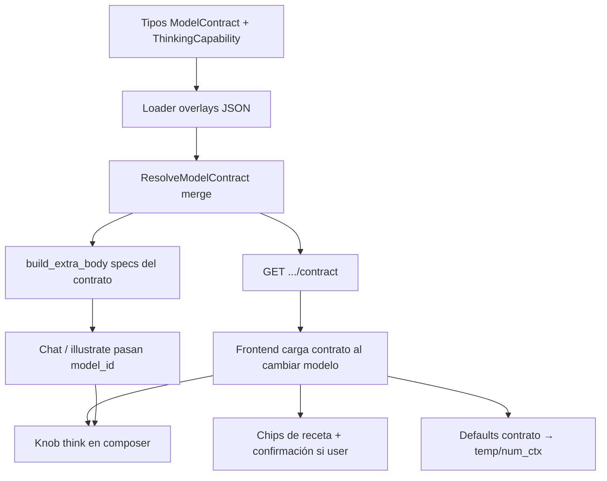
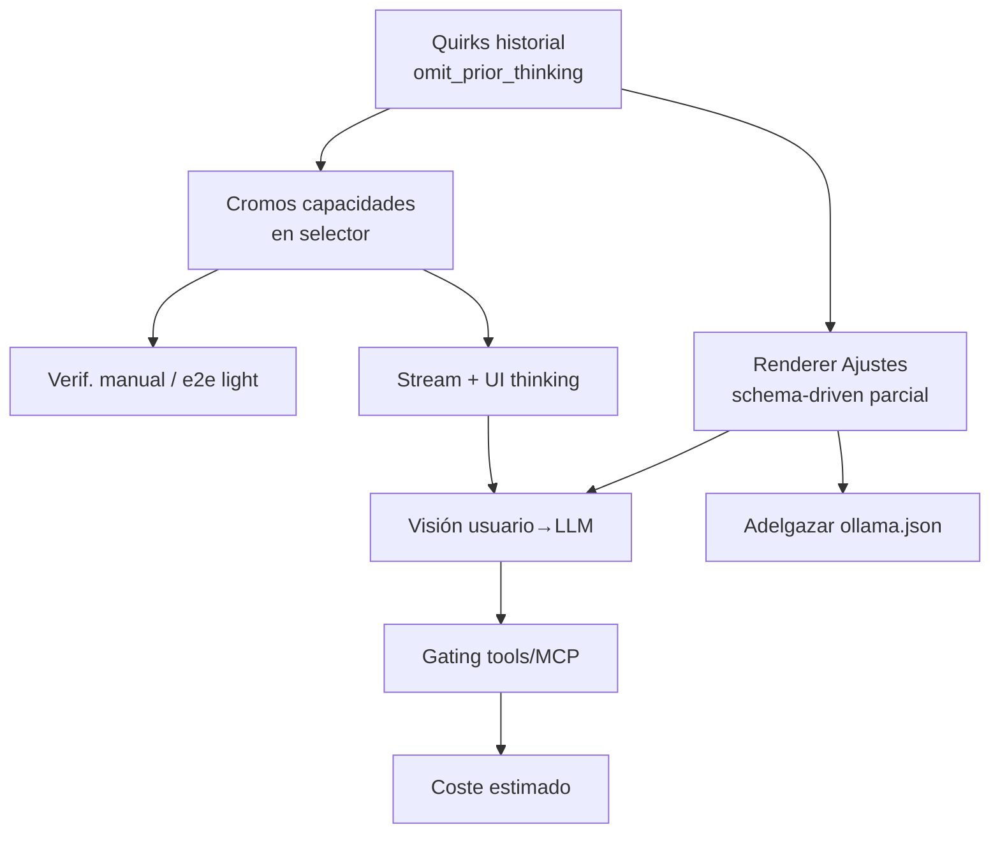

Última modificación: 2026-09-02

# Plan: Contrato de modelo

**Spec:** [`docs/specs/SPEC_MODEL_CONTRACT_2026-09-02.md`](../specs/SPEC_MODEL_CONTRACT_2026-09-02.md)  
**Diseño:** [`docs/DESIGN_MODEL_CONTRACT_2026-09-02.md`](../DESIGN_MODEL_CONTRACT_2026-09-02.md)  
**Checklist:** [`docs/checklists/MODEL_CONTRACT_CHECKLIST_2026-09-02.md`](../checklists/MODEL_CONTRACT_CHECKLIST_2026-09-02.md)

**Estado:** **v1 merged** en `main` (PR [#36](https://github.com/pcgarat/chatBot/pull/36), squash `0b85cc8`). Este plan cubre v1 (cerrada) y el **plan v2** abajo.

Este repo guarda planes en `docs/plans/` y tareas en `docs/checklists/` (no en `tasks/plan.md`).

---

## Overview (v1 — hecho)

Contrato de modelo resoluble (schema proveedor + `show` + overlay sparse) para (1) `GET .../contract`, (2) enviar `think` bien al proveedor, (3) knob thinking + chips de receta en el composer. Strategy solo en `LLMProvider`. Sin clases por modelo.

**Entregado además del MVP mínimo:** overlays de los **8 cloud** + defaults de contrato (temperature / `num_ctx`) en UI sin pisar overrides user.

## Architecture Decisions (siguen vigentes)

- **Overlay aditivo**, no reescritura de `config/ollama.json`.
- **Dominio en** `app/services/model_contract/`. `build_extra_body` pide specs al resolver.
- **Builder v1** = map de thinking + `set_nested`. Sin reescritura de historial → **eso es v2**.
- **UI lee el contrato**, no el nombre del modelo.
- **Visión / CoT en pantalla / quirks de historial / renderer Ajustes:** fuera de v1 → v2.

## Grafo v1 (completado)



## Task List v1 (cerrada)

Todas las fases 1–5 del checklist están hechas y mergeadas. Ver checklist para el detalle marcado `[x]`.

| Fase | Resultado |
|------|-----------|
| 1 Foundation | tipos, loader, merge, tests |
| 2 API | GET contract + e2e escrito |
| 3 Send path | `think` top-level; call sites con `model_id` |
| 4 Composer | knob + persistencia baseline |
| 5 Recetas | chips + confirm si origen user |
| Extra | 8 overlays cloud + defaults UI |

---

## Plan v2 — siguientes pasos

Cada corte en rama `feat/...` propia. Orden por valor / riesgo.



### Phase A — Quirks de historial (alta)

- [x] Task A1: Aplicar `omit_prior_thinking` al construir mensajes hacia el LLM (Gemma).
- [x] Task A2: Tests unitarios del builder de historial (con/sin quirk).
- Checkpoint: multi-turn Gemma no reenvía bloques thought; resto de modelos intactos.

### Phase B — Cromos en selector (alta)

- [x] Task B1: UI lee `capabilities` (+ ctx del contrato) y pinta cromos (visión / thinking / tools / ventana).
- [x] Task B2: Sin hardcode de nombres de modelo.
- Checkpoint: cambiar de GPT-OSS a Mistral a DeepSeek cambia cromos de forma coherente (barra de estado + Ajustes).

### Phase C — Verificación (alta, corta)

- [ ] Task C1: Manual — confirmación de receta cancelada no cambia params; round-trip think al recargar.
- [ ] Task C2 (opcional): e2e chat con `think` en verbose/payload si se toca endpoint de chat.
- Checkpoint: checklist de QA firmado en el checklist v2.

### Phase D — Renderer Ajustes parcial (media)

- [ ] Task D1: Mostrar/ocultar controles existentes según `contract.params`.
- [ ] Task D2: Progressive disclosure (visibles vs avanzados) sin redibujar todo el HTML de golpe.
- Checkpoint: modelo sin `top_p` en contrato no muestra el control; sin `if model ==`.

### Phase E — Stream + UI de thinking (media)

- [ ] Task E1: Consumir chunks `message.thinking` del stream Ollama.
- [ ] Task E2: Panel colapsable en el mensaje; no persistir/reenviar si quirk activo (coordina con A).
- Open: ¿guardar CoT en BD o solo vivo?

### Phase F — Visión usuario→LLM (media)

- [ ] Task F1: Adjunto visible solo si `capabilities.vision`.
- [ ] Task F2: Orden imagen-antes-de-texto si quirk `image_before_text`.
- Checkpoint: GPT-OSS sin botón; Gemma/Mistral con él.

### Phase G — Más tarde (baja)

- [ ] Gating tools/MCP por `capabilities.tools`.
- [ ] Coste estimado (research × tokens).
- [ ] Adelgazar `config/ollama.json` hacia overlays (sin romper «Cargar preset»).
- [ ] Overlays de modelos locales bajo demanda.
- [ ] Generador de overlays: [`SPEC_OVERLAY_GENERATOR_2026-09-02.md`](../specs/SPEC_OVERLAY_GENERATOR_2026-09-02.md).

## Cortes verticales v2

| Tras | Valor para el usuario |
|------|------------------------|
| A | Gemma multi-turn correcto |
| B | Entender de un vistazo qué ofrece el modelo |
| D | Ajustes no mienten (solo params del contrato) |
| E | Ver el razonamiento cuando el modelo lo emite |
| F | Usar visión de verdad en el chat |

## Risks v2

| Risk | Mitigation |
|------|------------|
| Quirk mal aplicado rompe historial de todos | Feature-flag por quirk; tests con mensajes mixtos |
| Renderer Ajustes reescribe demasiado HTML | Solo hide/show + disable; no genérico completo en el primer corte |
| CoT en BD hincha mensajes | Decidir persistencia antes de E2; default = solo vivo |
| Visión sin multimodal order en Gemma | Implementar quirk junto al upload |

## Open Questions (v2)

Ver spec. Cerradas en v1: rama, tipos JSON think, `think` solo vía contrato/overlay, persistencia knob = baseline (omitir si coincide).

## Verificación

```bash
make test
```

No `pytest tests/` sin `-m "not e2e"`.
