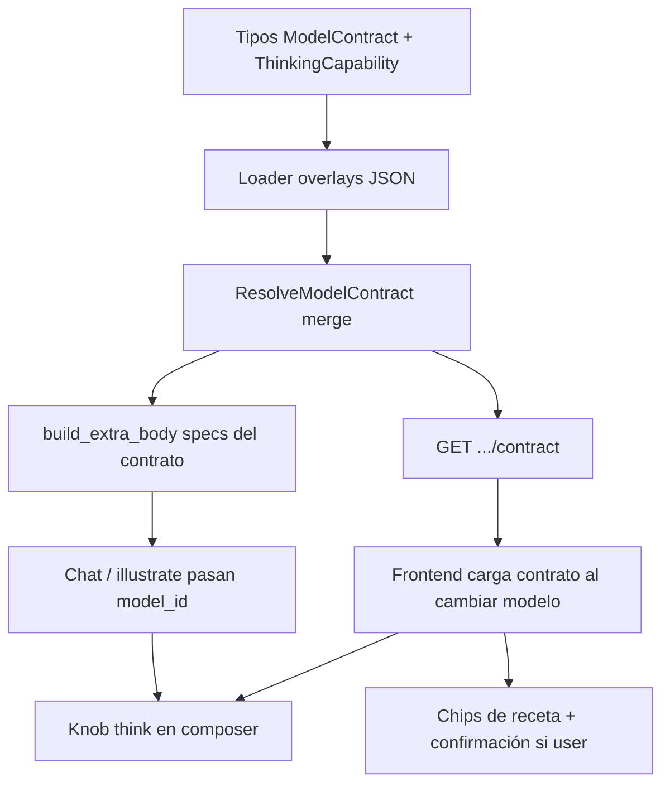

Última modificación: 2026-09-02

# Plan: Contrato de modelo

**Spec:** [`docs/specs/SPEC_MODEL_CONTRACT_2026-09-02.md`](../specs/SPEC_MODEL_CONTRACT_2026-09-02.md)  
**Diseño:** [`docs/DESIGN_MODEL_CONTRACT_2026-09-02.md`](../DESIGN_MODEL_CONTRACT_2026-09-02.md)  
**Checklist:** [`docs/checklists/MODEL_CONTRACT_CHECKLIST_2026-09-02.md`](../checklists/MODEL_CONTRACT_CHECKLIST_2026-09-02.md)

**Estado:** v1 implementada en `feat/model-contract`. Pendiente review humana / commit.

Este repo guarda planes en `docs/plans/` y tareas en `docs/checklists/` (no en `tasks/plan.md`).

---

## Overview

Añadir un **contrato de modelo** resoluble (schema proveedor + `show` + overlay sparse) y usarlo para (1) exponer `GET .../contract`, (2) enviar `think` bien al proveedor, (3) pintar thinking y recetas en el composer. Strategy sigue en `LLMProvider`. Cero clases por modelo.

## Architecture Decisions

- **Overlay aditivo**, no reescritura de `config/ollama.json`, para no romper «Cargar preset».
- **Dominio en** `app/services/model_contract/` al estilo `workspace_profiles` (tipos + merge + loader). `build_extra_body` se queda en `provider_params.py` y pide specs al resolver.
- **Builder v1 = map de thinking + `set_nested`**. Sin reescritura de historial.
- **UI lee el contrato**, no el nombre del modelo.
- **Visión / CoT en pantalla / quirks de historial: fuera.** Hoy no hay upload usuario→LLM ni campo thinking en mensajes.

## Grafo de dependencias



Orden: cimientos de dominio → contrato consultable → el chat **usa** el contrato → UI del knob → recetas. Cada fase deja el sistema usable (modelos sin overlay = comportamiento actual).

## Task List

### Phase 1: Foundation

- [ ] Task 1: Tipos de dominio
- [ ] Task 2: Overlays JSON + loader (GPT-OSS y DeepSeek)
- [ ] Task 3: Merge + tests unitarios

### Checkpoint: Foundation

- [ ] `pytest tests/test_model_contract.py -m "not e2e"` en verde
- [ ] GPT-OSS vs DeepSeek cubiertos por el mismo merge, datos distintos
- [ ] Revisión humana del shape del contrato antes del endpoint

### Phase 2: Contrato consultable

- [ ] Task 4: GET contract + schema Pydantic + tests API
- [ ] Task 5: Test e2e del GET (escrito, no ejecutado en el día a día)

### Checkpoint: API

- [ ] Curl/manual o test API: 200, thinking distinto, modelo sin overlay 200
- [ ] `/params` y `/presets` sin cambios de contrato

### Phase 3: El chat envía think

- [ ] Task 6: `build_extra_body` contract-aware + tests (think top-level, coerce)
- [ ] Task 7: Call sites chat/illustrate pasan `model_id`

### Checkpoint: Send path

- [ ] Test unitario: extra_body de DeepSeek con `think: "max"` → `{"think": "max", "options": {...}}` no `options.think`
- [ ] Chat sin overlay: igual que antes
- [ ] `make test`

### Phase 4: Composer thinking

- [ ] Task 8: Fetch contrato al cambiar modelo/proveedor
- [ ] Task 9: Knob think según `capabilities.thinking`
- [ ] Task 10: Persistir `think` en `model_params`

### Checkpoint: UI think

- [ ] GPT-OSS: low/medium/high, sin off
- [ ] DeepSeek: off / on / max
- [ ] Modelo local sin overlay: sin knob
- [ ] Verificar en navegador el cambio de modelo

### Phase 5: Recetas

- [ ] Task 11: Chips + no pisar overrides user sin confirmar

### Checkpoint: Complete

- [ ] Criterios de éxito de la spec
- [ ] `make test`
- [ ] Checklist actualizado
- [ ] Listo para review / PR cuando se pida

## Cortes verticales (qué puede usar el usuario)

| Tras fase | Valor |
|-----------|--------|
| 1 | Nada de producto; dominio testeable |
| 2 | Inspeccionar contrato por HTTP (debug / UI futura) |
| 3 | Recetas/think enviados desde `model_params` ya funcionan aunque la UI aún no tenga knob (cliente puede PUT params) |
| 4 | Knob usable de verdad |
| 5 | Perfiles de uso en un clic |

## Parallelization

- Tras Task 3, Tasks 4 y 6 pueden ir en paralelo (mismo contrato, archivos distintos: router vs `provider_params`).
- Overlay JSON (Task 2) bloquea tests de merge realistas; no paralelizar 2 y 3.
- UI (8–11) espera al menos el GET (Task 4). Puede mockear el JSON si el endpoint se retrasa, pero no vale la pena.

## Risks and Mitigations

| Risk | Impact | Mitigation |
|------|--------|------------|
| `build_extra_body` sin `model_id` deja think muerto | Alto | Firma con `model_id` opcional; tests de call sites; fail-fast en chat (siempre hay `conv.model_id`) |
| Overlay duplica schema y vuelve al copy-paste | Medio | Review: overlay solo deltas; test que el merge hereda `api_key` del proveedor |
| UI ramifica por nombre de modelo | Alto | Criterio de rechazo en review; test de contrato cubre ambos modelos |
| `show_model` lento/falla en cada cambio de modelo | Medio | Reusar ficha/`provider_info` cacheado si ya está; si show falla, omitir capa live |
| Coerce silencioso de think confunde | Bajo | El contrato expone `can_disable`; la UI no envía false |
| `app.js` monolítico | Medio | Funciones locales (`loadModelContract`, `renderThinkControl`); no refactor global |
| E2E Ollama caído | Bajo | e2e escrito; `make test` no lo corre |

## Open Questions

Las de la spec (rama, tipos JSON de think, persistir siempre el knob). Más:

- ¿Incluir `think` también en `provider_params.json` de ollama (visible para todos) o **solo** vía overlay/contrato? Recomendación: **solo contrato/overlay**. Si va al schema global, modelos sin thinking enviarían un param inútil o la UI mostraría un knob mentiroso hasta que el contrato lo oculte.

## Verificación global

```bash
make test
```

No `pytest tests/` sin `-m "not e2e"`.
