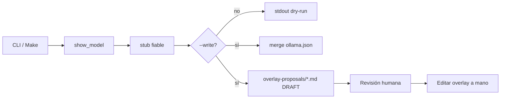

Última modificación: 2026-09-02

# Plan: Generador de overlays Ollama

**Spec:** [`docs/specs/SPEC_OVERLAY_GENERATOR_2026-09-02.md`](../specs/SPEC_OVERLAY_GENERATOR_2026-09-02.md)  
**Checklist:** [`docs/checklists/OVERLAY_GENERATOR_CHECKLIST_2026-09-02.md`](../checklists/OVERLAY_GENERATOR_CHECKLIST_2026-09-02.md)

**Rama:** `feat/overlay-generator`

---

## Overview

CLI que, a partir de `ollama show`, onboardea modelos nuevos: **auto-write** del stub fiable en `config/model_overlays/ollama.json` (solo con `--write`) y **propuesta DRAFT** en `docs/research/overlay-proposals/` para lo dudoso (revisión humana). Dry-run por defecto. Modos: un modelo y batch (missing; all opcional).

## Architecture Decisions

- **Fuera del request path:** no generar en `GET /contract`.
- **Reutilizar** extracción live de show (misma semántica que `resolve._live_from_show`) para no divergir cromos.
- **Preserve curado:** recipes / quirks / thinking levels no se sobrescriben.
- **Propuestas en research:** mismo árbol documental que las fichas cloud; no JSON “oculto” al lado del overlay.



## Task order

1. stub + merge + tests  
2. proposal renderer + tests  
3. CLI un modelo  
4. batch missing (+ batch-all)  
5. Make targets + README proposals  
6. Checkpoint manual + `make test`

## Risks

| Risk | Mitigation |
|------|------------|
| Write pisa Gemma/GPT-OSS | Tests preserve; merge solo huecos |
| Show sin ctx → stub pobre | Propuesta lo declara; cromos parciales OK |
| Batch falla a mitad | Escribir JSON al final o por modelo con flush; documentar |
| Heurísticas por nombre en runtime | Prohibido; solo texto DRAFT en md |

## Open Questions

Ver spec (batch-all opcional = sí en plan; índice cloud = no MVP).

## Verificación

```bash
make test
make overlay MODEL=<id>          # dry-run
make overlay-batch               # dry-run missing
```
