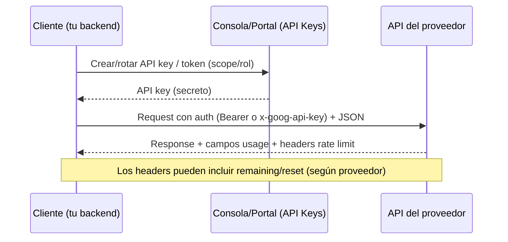
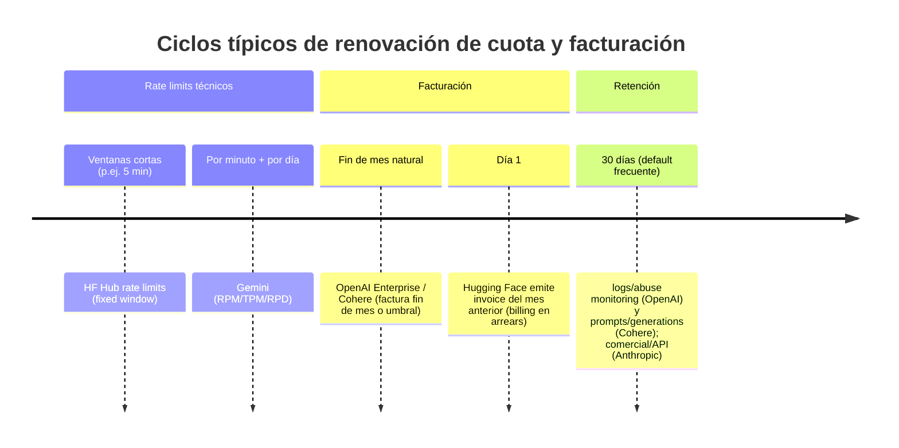

# Informe comparativo de información expuesta por proveedores de LLM

## Resumen ejecutivo

Los proveedores “tipo API” (p. ej., OpenAI, Anthropic, Cohere, Mistral) suelen exponer **catálogo de modelos** (con metadatos de alto nivel), **endpoints de inferencia** (chat/completions/embeddings) y **métricas de consumo** (tokens, peticiones, costes) con distintos niveles de granularidad. En el extremo más completo, OpenAI ofrece endpoints administrativos de **uso y costes por organización** (agregables por modelo/proyecto/clave/usuario) y controles formales de **retención/Zero Data Retention**. citeturn10view0turn8view0turn11view0

Los “hubs” (Hugging Face) destacan por exponer **metadatos ricos** (tags, ficheros del repo, config, card data, etc.), además de **tres capas de consumo**: (a) límites de plataforma (RateLimit headers), (b) facturación mensual para servicios “compute” y (c) enrutamiento a proveedores de inferencia con créditos mensuales y facturación centralizada. citeturn13view1turn20view1turn20view3turn25view1

Los “runtimes locales” (Ollama) trasladan la observabilidad a tu máquina: exponen endpoints locales para **listar modelos**, **ver detalles** (plantilla, licencia, parámetros, capacidades) y **ver modelos en ejecución**, sin “cuota” contractual (salvo el caso de usar su API cloud). citeturn29view2turn30search0

En plataformas tipo “cloud suite” (Google Gemini API), la información publicada suele centrarse en **endpoints de inferencia**, **autenticación por API key** y **cuotas técnicas** (RPM/TPM/RPD y resets diarios), con visibilidad de límites en consola y upgrades por “tier”. citeturn31view6turn29view0turn31view2

## Qué se entiende por “información expuesta” y limitaciones del análisis

En este informe, “información expuesta” agrupa cinco familias:

1) **Descubrimiento y catálogo**: endpoints para listar modelos disponibles al cliente (y, cuando existe, su compatibilidad por endpoint/capacidad).  
2) **Metadatos del modelo**: desde “id/created/owned_by” (mínimo) hasta card data, ficheros, tokenizer, config, licencias, etiquetas, etc. (máximo; típico de hubs).  
3) **Métricas de uso y facturación**: tokens/peticiones (por respuesta y/o agregados por ventana temporal), costes, límites (rate limits) y ciclo de facturación/renovación.  
4) **Privacidad y retención**: retención de logs, “opt-out” de entrenamiento, y modos ZDR (cuando existen).  
5) **Operación local**: cómo consultar metadatos y “métricas” (al menos ejecución/listado) sin depender del proveedor.

Limitación deliberada: el requisito “para cada modelo público” se interpreta como **para cada servicio público** (catálogo, inferencia, uso/costes, etc.), porque listar exhaustivamente miles de IDs (HF) o variantes internas (APIs comerciales) no es útil ni estable. Cuando un dato no figura en documentación pública consultada, se marca como **“no especificado”**.

## Comparativa por proveedor

**entity["company","OpenAI","ai company, san francisco"]**

**Endpoints y contrato de acceso (API):**  
Base: `https://api.openai.com/v1` (REST). Autenticación típica: `Authorization: Bearer <API_KEY>`; los endpoints administrativos de organización usan **Admin API Key** (p. ej. `$OPENAI_ADMIN_KEY` en ejemplos oficiales). citeturn0search0turn10view0turn8view0  
Rate limits: OpenAI expone cabeceras de rate limit (límite, restante y reset) como `x-ratelimit-limit-requests`, `x-ratelimit-remaining-requests`, `x-ratelimit-reset-requests` (y equivalentes para tokens). citeturn0search0  

Endpoints relevantes (selección estable y orientada a “información”):
- Catálogo: `GET /models`. citeturn0search0  
- Uso agregado (org): p. ej. `GET /organization/usage/completions` (también embeddings, imágenes, moderación, etc.). citeturn10view0turn10view1  
- Costes agregados (org): `GET /organization/costs`. citeturn8view0  

Ejemplo de llamada real (costes org, oficial):
```bash
curl "https://api.openai.com/v1/organization/costs?start_time=1730419200&limit=1" \
  -H "Authorization: Bearer $OPENAI_ADMIN_KEY" \
  -H "Content-Type: application/json"
```
La propia documentación publica un ejemplo de respuesta tipo “page/bucket/results” con `amount.value/currency`. citeturn8view0  

**Metadatos expuestos (modelo):**  
En OpenAI, el listado/catálogo tiende a exponer metadatos **operativos** (identificador, propiedad/owner, etc.) y no parámetros internos (tamaño exacto, tokenizer, nº parámetros) — normalmente **no especificados** públicamente. Aun así, sí se exponen objetos de “application state” cuando aplica (p. ej., objetos persistentes en endpoints de conversaciones/threads/vector stores). citeturn11view0  

**Uso/facturación y “porcentaje de uso”:**  
- Para “porcentaje de uso” práctico, OpenAI permite leer **consumo agregado** (tokens de entrada/salida, peticiones) por ventanas (`bucket_width=1m|1h|1d`) y filtrar/agrupador por `api_key_id`, `model`, `project_id`, `user_id`, etc. citeturn10view1turn10view2  
- Ejemplo oficial (uso completions): devuelve `input_tokens`, `output_tokens`, `input_cached_tokens`, `num_model_requests`, etc. citeturn10view0turn10view1  
- Ciclo de facturación: para API Enterprise, OpenAI indica facturación al **final de cada mes natural** y emisión de factura típicamente en las dos semanas siguientes (salvo acuerdos distintos). citeturn12view0  

Ejemplo de respuesta agregada (publicada) para uso de completions:
```json
{
  "object": "page",
  "data": [{
    "object": "bucket",
    "start_time": 1730419200,
    "end_time": 1730505600,
    "results": [{
      "object": "organization.usage.completions.result",
      "input_tokens": 1000,
      "output_tokens": 500,
      "input_cached_tokens": 800,
      "num_model_requests": 5
    }]
  }],
  "has_more": true,
  "next_page": "page_AAAA..."
}
```
Basado en el ejemplo oficial del endpoint. citeturn10view0turn10view1  

**Privacidad/retención:**  
- Desde 2023-03-01, OpenAI documenta que los datos enviados a la API **no se usan para entrenar** modelos salvo opt-in explícito. citeturn11view0  
- Retención por defecto de “abuse monitoring logs”: hasta **30 días**; y existe “Modified Abuse Monitoring” y “Zero Data Retention”, sujeto a aprobación. citeturn11view0  
- La misma página desglosa, por endpoint, si hay “application state retention”, incluyendo casos donde ciertos endpoints almacenan hasta borrado (p. ej. conversations) o indefinidamente si el cliente no borra objetos (p. ej. Assistants-related). citeturn11view0  

---

**entity["company","Anthropic","ai company, san francisco"]**

**Endpoints y contrato de acceso (API):**  
- Catálogo: `GET https://api.anthropic.com/v1/models` (lista modelos con `data[]`). citeturn3view0  
- Inferencia: `POST https://api.anthropic.com/v1/messages` (no mostrado aquí en detalle; se centra el informe en endpoints “de información”).  
Autenticación: la documentación de Anthropic usa `x-api-key` y versionado por cabecera (p. ej. `anthropic-version`), además de `content-type`. citeturn3view0  

**Metadatos expuestos (modelo):**  
El listado oficial incluye campos tipo `id`, `display_name`, `created_at`, `type`. No se publican de forma general parámetros internos (nº parámetros, tokenizer) como parte del endpoint de modelos: **no especificado**. citeturn3view0  

Ejemplo sintético (estructura del listado):
```json
{
  "data": [
    { "id": "claude-...", "display_name": "...", "created_at": "...", "type": "model" }
  ],
  "has_more": false
}
```
Estructura basada en el esquema/documentación del endpoint de modelos. citeturn3view0  

**Uso/facturación y “porcentaje de uso”:**  
Anthropic destaca por exponer endpoints administrativos de “reporting”:
- `GET /v1/organizations/usage_report` (reporte de uso). citeturn4search0turn4search14  
- `GET /v1/organizations/cost_report` (reporte de costes). citeturn4search4  

Estos reportes admiten dimensiones y agregación temporal (detalle exacto: según contrato y permisos; la API documenta la existencia y estructura). Además, en “usage report” aparece `inference_geo` como dimensión (útil para residencia/ubicación de inferencia). citeturn4search14turn4search4  

**Privacidad/retención:**  
- Para “Commercial (Team/Enterprise/API)” Anthropic documenta retención estándar de **30 días** y opción de **Zero Data Retention** con claves/configuración apropiada (según producto/contrato). citeturn6search6  
- Sobre borrado ad hoc de datos enviados por API: el centro de privacidad indica que para clientes de API de pago no soportan “ad hoc deletion” (remite a sus prácticas de retención) y que no usan datos de API para entrenamiento salvo acuerdo explícito en contrario. citeturn6search21  

---

**entity["company","Hugging Face","ml platform, new york"]**

Para HF conviene separar: (a) **Hub (metadatos/repos)**, (b) **Inference Providers (router OpenAI-compatible)** y (c) **facturación/limitación**.

**Endpoints y contrato de acceso (Hub: metadatos):**  
Base declarada: `https://huggingface.co` (los endpoints del Hub son relativos a ese host). citeturn14view0turn13view0  
En el cliente oficial `huggingface_hub`, se observa el mapeo directo:
- Identidad/plan del token: `GET /api/whoami-v2`. citeturn25view0  
- Listado: `GET /api/models` (con filtros; pagination). citeturn25view1  
- Ficha de repositorio: `GET /api/models/{repo_id}` (admite `securityStatus`, `blobs`/metadata de ficheros y `expand`). citeturn25view1  

**Autenticación y scopes (Hub/Providers):**  
HF usa “User Access Tokens” con roles/scope (`read`, `write`, `fine-grained`). Los tokens se pasan como Bearer y se recomiendan tokens fine-grained para producción. citeturn20view2  

**Rate limits (Hub):**  
Se definen 3 “buckets” (Hub APIs, Resolvers, Pages) medidos en ventanas fijas de **5 minutos**, con cabeceras estándar `RateLimit` y `RateLimit-Policy` y panel de “billing” para ver consumo/techo actual. citeturn13view1  

**Metadatos expuestos (modelo en Hub):**  
HF puede exponer metadatos muy ricos, incluyendo `tags`, `siblings` (ficheros), `config`, `cardData`, `createdAt`, `downloads`, `gated`, `private`, `safetensors`, `transformersInfo`, etc. (en la práctica, controlado por parámetros como `full`, `cardData`, `config`, `expand`). citeturn25view1turn24view0  

**Endpoints y contrato de acceso (Inference Providers: inferencia y compatibilidad OpenAI):**  
Base router: `https://router.huggingface.co/v1` y el propio doc muestra uso con SDK OpenAI (OpenAI-compatible). citeturn20view0  
Autenticación: cabecera `Authorization` con Bearer `hf_...` y el token debe incluir permiso “Inference Providers”. citeturn20view0turn20view2  

**Uso/facturación (Inference Providers y compute HF):**  
- Credits mensuales: HF documenta crédito mensual (Free/PRO/Team/Enterprise) y la posibilidad de pay-as-you-go (para PRO y orgs) cuando se agotan los créditos. citeturn20view1  
- Facturación a organización: se soporta cabecera `X-HF-Bill-To: <org>` para imputar consumo. citeturn20view1  
- Facturación mensual (compute HF): factura de uso del mes anterior emitida el **día 1 de cada mes**, y además cobros por “billing thresholds” durante el mes si se supera cierto acumulado. citeturn20view3  

Ejemplo (impresión práctica de discovery + plan del token): “whoami-v2” devuelve datos sobre el token/rol (la librería lo usa para deducir role). citeturn25view0turn20view2  

---

**entity["company","Cohere","ai company, toronto"]**

**Endpoints y contrato de acceso (API):**  
- Listado de modelos: `GET https://api.cohere.com/v1/models` (paginación con `page_size`, `page_token`). citeturn29view3  
- Chat (v2): (documentación de request/response y parámetros avanzados) con autenticación Bearer. citeturn28view0  

La documentación de “rate limits” distingue explícitamente **trial keys** vs **production keys**, con límites por endpoint/modelo. citeturn28view1  

**Metadatos expuestos (modelo):**  
El endpoint `/v1/models` devuelve, por modelo, `name`, `is_deprecated`, `endpoints` compatibles, `context_length`, `tokenizer_url`, `features`, etc. citeturn29view3  

Ejemplo oficial (recortado):
```json
{
  "models": [{
    "name": "command-xlarge-nightly",
    "is_deprecated": false,
    "endpoints": ["generate", "chat"],
    "finetuned": false,
    "context_length": 2048,
    "tokenizer_url": "https://cohere.com/tokenizer/command-xlarge-nightly.json",
    "default_endpoints": ["generate"],
    "features": ["text-generation", "chat-completions"]
  }],
  "next_page_token": "eyJwYWdlIjoxfQ=="
}
```
Ejemplo publicado por el endpoint de listado. citeturn29view3  

**Uso/facturación y renovación:**  
- Facturación: Cohere indica emisión de cargo/factura al **final de cada mes natural** o cuando se alcance un umbral de **$250** de saldo pendiente. citeturn28view2  
- Rate limits: se publican límites por minuto y/o por endpoint (p. ej. “req/min” para Chat según modelo) y límites mensuales (trial keys limitadas a “1,000 API calls a month”). citeturn28view1  
- “Porcentaje de uso”: no hay un endpoint público estándar en esta muestra para “cuota restante”, pero sí se puede aproximar mediante: (a) rate limits publicados y (b) token usage por respuesta (la API indica que la respuesta incluye `usage`). citeturn28view0turn28view1  

**Privacidad/retención:**  
- Cohere declara borrado automático de “logged prompts and generations” a los **30 días**, con excepciones (requisitos legales/contractuales o contenido marcado por abuso), opción de opt-out de entrenamiento y posibilidad de **Zero Data Retention** para clientes aprobados. citeturn28view3  

---

**entity["company","Mistral AI","ai company, paris"]**

**Endpoints y contrato de acceso (API):**  
La documentación de API muestra un conjunto OpenAI-compatible para chat:
- `POST /v1/chat/completions` (request con `messages`, `model`, `temperature`, `stream`, `response_format`, etc.). citeturn29view1  
- Catálogo: `GET /v1/models` (lista los modelos disponibles al usuario). citeturn30search3  

En los ejemplos oficiales de SDK se inicializa cliente con `apiKey: "MISTRAL_API_KEY"`. (El detalle exacto de cabeceras HTTP en “raw curl” no aparece en los extractos citados → **no especificado** aquí). citeturn29view1  

**Metadatos expuestos (modelo):**  
El endpoint de modelos se describe como “List all models available to the user”, devolviendo `data` con tarjetas base y/o fine-tuned. Campos internos como nº parámetros/tokenizer: **no especificado** en el endpoint descrito. citeturn30search3  

**Uso/facturación, renovación y retención:**  
En los extractos consultados no se publica un endpoint análogo a “cost_report/usage_report” (Anthropic) u “organization/costs” (OpenAI). Se marca como **no especificado** a nivel de API pública citada (aunque puede existir en consola/contrato).  

---

**entity["company","Google","subsidiary of alphabet"]**

Se distingue entre **Gemini API (Google AI for Developers)** y **Vertex AI (Google Cloud)**. Aquí se cubre Gemini API, que es donde se publican los ejemplos HTTP directos.

**Endpoints y contrato de acceso (Gemini API):**  
La referencia oficial muestra llamadas tipo:
- Generación: `POST https://generativelanguage.googleapis.com/v1beta/models/{model}:generateContent` citeturn31view6turn31view4  
- Streaming: `POST https://generativelanguage.googleapis.com/v1beta/models/{model}:streamGenerateContent?alt=sse` citeturn31view5turn31view4  

Autenticación: API key requerida. Se puede enviar como:
- cabecera `x-goog-api-key: $GEMINI_API_KEY` citeturn31view3turn31view6  
- o querystring `?key=$GEMINI_API_KEY` en ejemplos shell. citeturn31view4turn31view5  

Ejemplo oficial (shell, generateContent):
```bash
curl "https://generativelanguage.googleapis.com/v1beta/models/gemini-2.0-flash:generateContent?key=$GEMINI_API_KEY" \
  -H 'Content-Type: application/json' \
  -X POST \
  -d '{ "contents": [{ "parts":[{"text":"Write a story about a magic backpack."}] }] }'
```
Basado en ejemplo oficial. citeturn31view4turn31view5  

**Metadatos expuestos (modelo):**  
En estos extractos, la documentación citada evidencia el “modelo” como parte del path (`models/{model}`) y el uso de variantes (p. ej. `gemini-2.0-flash`, `gemini-2.5-flash`). No se detalla aquí un endpoint oficial de “list models” → **no especificado en las fuentes citadas** para este informe.

**Uso/facturación y renovación de cuota:**  
- Rate limits se miden en RPM, TPM (input) y RPD; y **RPD resetea a medianoche (Pacific time)**. citeturn29view0  
- Rate limits aplican por **proyecto** (no por API key). citeturn29view0  
- Tiers: el documento describe tiers y criterios (p. ej. spending acumulado en billing account) y que el servicio usa Cloud Billing para transición a tier pagado. citeturn29view0  

**Privacidad/retención:**  
No se incluye un extracto oficial de retención específica en estas fuentes citadas → **no especificado** en este informe.

---

**entity["company","Meta","tech company, menlo park"]**

Meta, como “proveedor” de LLM open-weight (familia Llama), suele exponer **metadatos y condiciones** vía **model cards y licencias**, no vía un endpoint REST único de inferencia (la inferencia se consume vía terceros: Hugging Face, runtimes locales, clouds).

**Metadatos expuestos:**  
- Blog de lanzamiento: Llama 3 se describe como familia con variantes (p. ej. 8B y 70B parámetros). citeturn30search10  
- Hub oficial en Hugging Face lista colecciones (p. ej. Llama 3.3 70B; Llama 3.2 1B/3B; etc.). citeturn30search6  
- Model Card: existe un “MODEL_CARD.md” en repo oficial (detalle completo fuera de extractos mostrados aquí). citeturn30search14  

**Licencia:**  
Meta publica licencia específica para Llama (ejemplo: Llama 3). citeturn30search2turn30search26  

**Uso/facturación/retención:**  
Depende del canal de hosting (cloud, hub, runtime local). Como “Meta-distribución de pesos”, no aplica un “reset de cuota” propio.

---

**entity["company","Ollama","local llm runtime company"]**

**Endpoints y contrato de acceso (local y cloud):**  
- Base local: `http://localhost:11434/api` (servido por defecto tras instalar). citeturn29view2  
- Base cloud (ollama.com): `https://ollama.com/api`. citeturn29view2  
La referencia enumera endpoints para: generar, chat, embeddings, listar modelos, listar modelos en ejecución, mostrar detalles, etc. citeturn29view2  

**Metadatos expuestos (modelo):**  
El endpoint “Show model details” describe respuesta JSON con:
- `parameters` (texto serializado de settings), `license`, `modified_at`, `details`, `template`, `capabilities`, `model_info` (metadatos adicionales). citeturn30search0  

La documentación de “Modelfile” describe piezas que impactan directamente en esos metadatos (FROM/PARAMETER/TEMPLATE/SYSTEM/LICENSE, etc.). citeturn30search16  

Ejemplo mínimo (forma esperada, recortado):
```json
{
  "license": "...",
  "modified_at": "2025-01-01T00:00:00Z",
  "parameters": "temperature 0.7\nnum_ctx 8192\n...",
  "template": "...",
  "capabilities": ["chat", "tools"],
  "model_info": { "..." : "..." }
}
```
Campos tomados del contrato del endpoint “Show model details”. citeturn30search0  

**Uso/facturación, renovación y retención (local):**  
- En local no existe “cuota por contrato” (no hay facturación del proveedor por tokens) y la retención depende de tu máquina.  
- Lo “consultable” como observabilidad mínima sin instrumentación externa es: lista de modelos, detalles del modelo y lista de modelos en ejecución (este último figura como endpoint dedicado en la referencia). citeturn29view2turn30search0  

## Tabla comparativa

| Proveedor | Endpoint principal (info) | Autenticación | Metadatos expuestos (resumen) | Métricas de uso disponibles | Renovación / reset | Retención (publicada) | Observaciones |
|---|---|---|---|---|---|---|---|
| OpenAI | `https://api.openai.com/v1/models` citeturn0search0 | Bearer key; endpoints org usan Admin key citeturn10view0turn8view0 | Básicos en catálogo; estado/objetos persistentes según endpoint citeturn11view0 | Uso/costes agregados por org: `.../organization/usage/*`, `.../organization/costs` citeturn10view0turn8view0 | Facturación fin de mes natural (Enterprise) citeturn12view0 | Logs de abuso hasta 30 días por defecto; ZDR/MAM disponibles citeturn11view0 | Cabeceras de rate limit con “remaining/reset” citeturn0search0 |
| Anthropic | `https://api.anthropic.com/v1/models` citeturn3view0 | `x-api-key` + versionado por cabecera citeturn3view0 | `id/display_name/created_at/type` citeturn3view0 | Reportes org: `usage_report` y `cost_report` citeturn4search0turn4search4 | No especificado (API pública citada) | 30 días comercial/API; opción ZDR citeturn6search6turn6search21 | Incluye dimensión `inference_geo` en reporting citeturn4search14 |
| Hugging Face (Hub) | `https://huggingface.co/api/models` citeturn25view1 | HF token (`read/write/fine-grained`) citeturn20view2 | Muy rico: tags, cardData, config, ficheros, securityStatus, etc. citeturn25view1turn24view0 | RateLimit headers (5 min windows) + panel citeturn13view1 | Ventana fija 5 min (rate limits) citeturn13view1 | No especificado (depende del servicio) | “Resolvers” y descargas tienen bucket propio citeturn13view1 |
| Hugging Face (Router) | `https://router.huggingface.co/v1/chat/completions` citeturn20view0 | Bearer `hf_...` con permiso Inference Providers citeturn20view0turn20view2 | OpenAI-compatible + selección por `model` (incluye “:provider”) citeturn20view0 | Créditos mensuales + breakdown por modelo/proveedor en settings citeturn20view1 | Créditos mensuales citeturn20view1 | No especificado (y puede variar por proveedor) | Facturación org con `X-HF-Bill-To` citeturn20view1 |
| Cohere | `https://api.cohere.com/v1/models` citeturn29view3 | Bearer token citeturn29view3turn28view0 | `context_length`, `tokenizer_url`, endpoints compatibles, etc. citeturn29view3 | Limits publicados (req/min, etc.) + `usage` en respuesta Chat citeturn28view1turn28view0 | Factura fin de mes o umbral $250 citeturn28view2 | Logs (prompts/generations) 30 días; ZDR para aprobados citeturn28view3 | Trial keys limitadas (incl. 1.000 calls/mes) citeturn28view1 |
| Mistral AI | `https://api.mistral.ai/v1/models` citeturn30search3 | API key (SDK); headers raw no especificados aquí citeturn29view1 | “Model cards” base/FT en `data[]` (detalle no especificado en extracto) citeturn30search3 | No especificado (API pública citada) | No especificado | No especificado | API muy OpenAI-like para chat completions citeturn29view1 |
| Google Gemini API | `https://generativelanguage.googleapis.com/v1beta/...` citeturn31view6 | API key (`x-goog-api-key` o `?key=`) citeturn31view3turn31view4 | Modelo en path `models/{model}`; metadatos internos no especificados citeturn31view6 | Rate limits RPM/TPM/RPD; RPD reset midnight PT citeturn29view0 | RPD resetea diario (PT); upgrades por tier citeturn29view0 | No especificado | Límite por proyecto, no por key citeturn29view0 |
| Meta (Llama) | (sin endpoint único de inferencia) | N/A (open-weight; depende del hosting) | Model cards + licencias + listados en hubs citeturn30search14turn30search6turn30search2 | Depende del hosting | Depende del hosting | Depende del hosting | Licencia específica de Llama citeturn30search2turn30search26 |
| Ollama (local) | `http://localhost:11434/api` citeturn29view2 | Normalmente sin auth en local (no especificado); cloud: según servicio | `POST /api/show` expone template, licencia, parámetros, etc. citeturn30search0turn30search16 | No hay cuota contractual local; “running models” disponible citeturn29view2 | N/A local | N/A local | También ofrece base cloud `https://ollama.com/api` citeturn29view2 |

## Diagramas de referencia





## Fuentes oficiales prioritarias

OpenAI (referencia técnica y políticas): guía “Your data / Data controls”, endpoints de uso/costes por organización y artículo de facturación API. citeturn11view0turn10view0turn8view0turn12view0

Anthropic (referencia técnica y reporting): endpoint de modelos y endpoints de “usage_report / cost_report”; centro de privacidad para API y guía de retención de Claude Code (incluye comercial/API). citeturn3view0turn4search0turn4search4turn6search21turn6search6

Hugging Face (Hub + billing + inference): rate limits (headers y ventanas), tokens/roles, billing, router OpenAI-compatible y documentación de Inference Providers. citeturn13view1turn20view2turn20view3turn20view0turn20view1turn25view1

Cohere (API + pricing + privacidad): endpoints de modelos y chat, rate limits (trial vs prod), página de pricing (ciclo de cobro) y “Enterprise Data Commitments” (retención, opt-out, ZDR). citeturn29view3turn28view0turn28view1turn28view2turn28view3

Mistral AI (API): endpoints de modelos y chat completions (OpenAI-like). citeturn30search3turn29view1

Google Gemini API (API + cuotas): ejemplos oficiales de endpoints `generateContent/streamGenerateContent`, autenticación por API key y rate limits (RPM/TPM/RPD, reset diario). citeturn31view6turn31view4turn31view2turn29view0

Meta Llama (licencia y distribución): licencia y presencia en hub/meta-llama; anuncio de la familia Llama 3 con tamaños. citeturn30search2turn30search26turn30search6turn30search10

Ollama (local): referencia oficial de API (base local/cloud) y contrato de “show model details” + modelfile. citeturn29view2turn30search0turn30search16